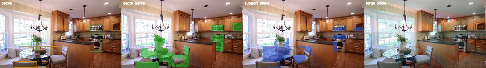
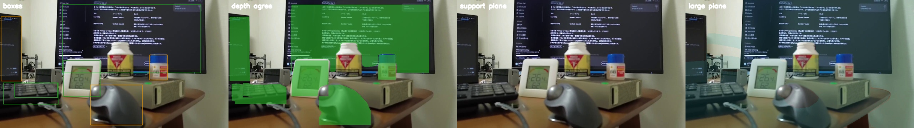

# 論文の観測を同じ28フレームで比べた

最適化器そのものは回していない。各論文が「観測として使うもの」が、この室内映像で成立するかを数えた。深度は `DA3-SMALL` の相対値。Mini 3 以外の焦点は幅の 0.9 倍。重力は IMU が無いので、カメラが水平なときの上方向で代用した。

集計は `paper_verify.yaml`。比較画像は `figures/`。左から、検出箱、深度が揃った画素、支持平面、画像の 12% 以上を占める面。

検出は 102。フレームは 28。

| 論文 | この映像で測ったこと | 結果 |
| --- | --- | --- |
| QuadricSLAM（Nicholson ら, RA-L 2019） | 箱を相対深度で持ち上げ、厚み / 長辺が 0.20 未満なら平面。同じ映像の2枚で、クラスが同じかつ箱の重なりが 0.1 を超える組 | 平面 40 / 102。厚みの中央値 0.24。2枚で対応した組は 18。箱だけでは楕円体の大きさは決まらない、という論文の前提のまま、深度を足しても 40 箱は薄い面で、楕円体に載らない |
| Liao ら（Sensors 2020） | 法線が重力から 10 度以内の面を支持平面とし、箱がその面に 20% 以上乗るか。論文は IMU か床から重力を取る | 支持平面があるフレームは 7 / 28。その面に乗る箱は 25 / 102。残りの箱では、論文の「支持平面を除いて物体点を残す」完全モデルは始まらない |
| CubeSLAM（Yang, Scherer, TRO 2019） | 12 本以上の直線が 3 度以内で交わる点を消失点とする。直方体の提案には消失点が2つ要る | 消失点が1つ以上のフレームは 22 / 28。2つあるのは 16 / 28。消失点の提案自体は半数以上で立つ。直方体の最適化はしていない |
| Kimera（Rosinol ら, IJRR 2021） | 画像の 12% 以上の面を壁や床などの構造とし、深度が揃った領域とその面の重なりが 0.70 以上なら、箱は構造の一部 | 構造の面は 28 / 28 フレームにある。箱 43 / 102 がその面と重なる |

## 読み

深度が揃った画素は、キッチンの画像では椅子やレンジの箱の中をほぼ塗る。支持平面は別の領域で、箱の中を物体として切り出してはいない。広い面は毎フレームあるが、箱の全部ではなく約4割と重なる。

QuadricSLAM の楕円体は、厚みが長辺の 0.2 未満の 40 箱には合わない。Liao らの支持平面は、水平に近い面が見える 7 フレームでしか物体の切り出しに使えない。CubeSLAM の消失点は 16 フレームで2点まで出るので、室内で最初に欠けるのは消失点ではない。Kimera の分け方は、このデータの約4割の箱が家具ではなく部屋の面だ、という結果になる。

仮説の「揃った画素はその物体」は、揃った領域が支持平面とも構造面とも一致しない。揃いは物体の名前でも、床からの切り出しでもない。

## まだやっていないこと

論文の因子グラフ、楕円体の同時最適化、IMU の重力、メートル深度は回していない。上の表は、その前段の観測がこの 28 フレームで何件立つかである。
