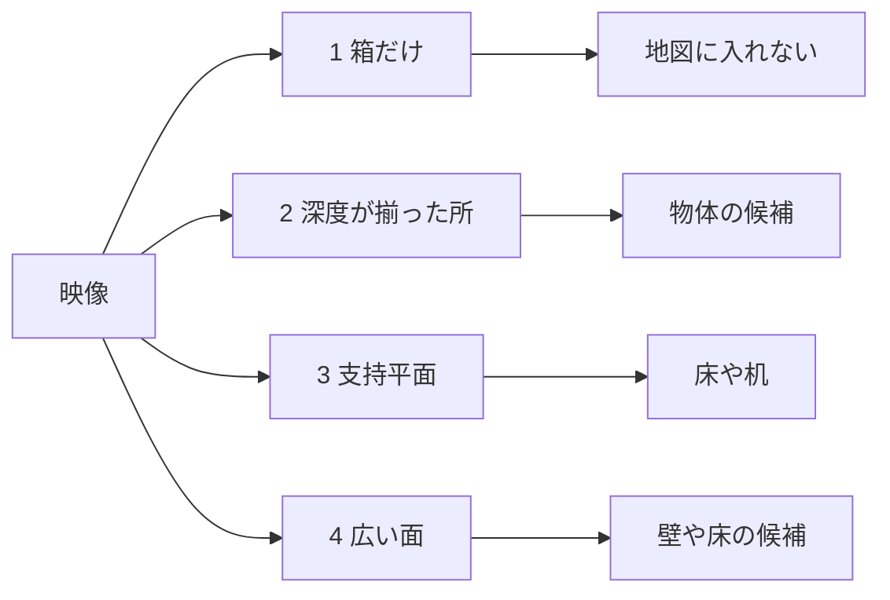
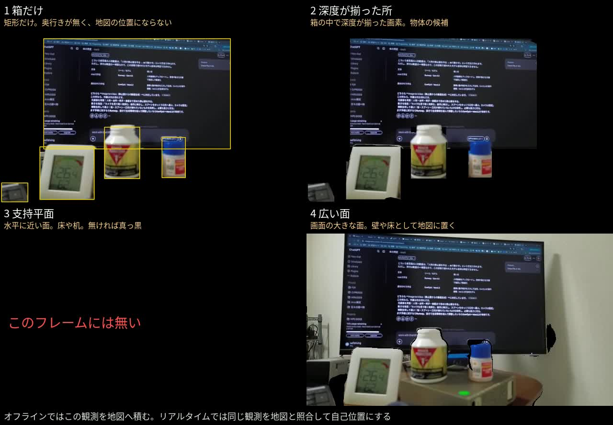
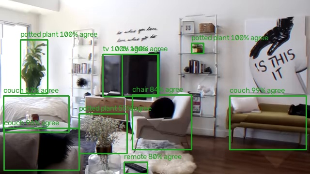
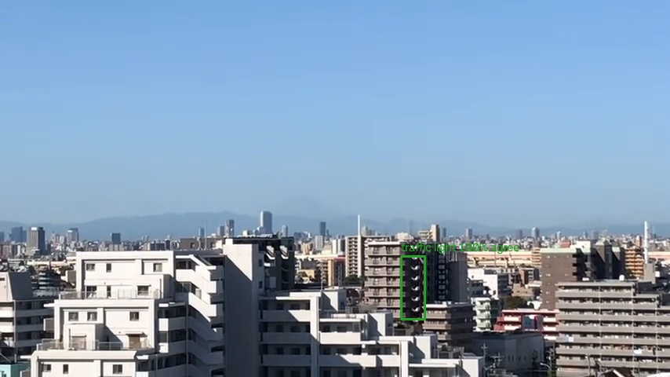
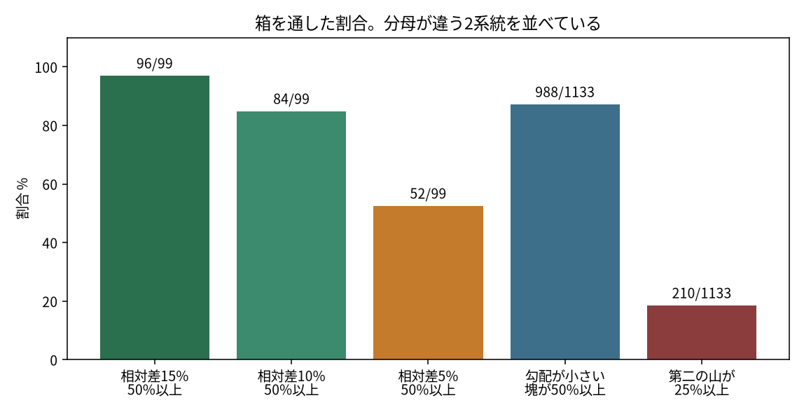
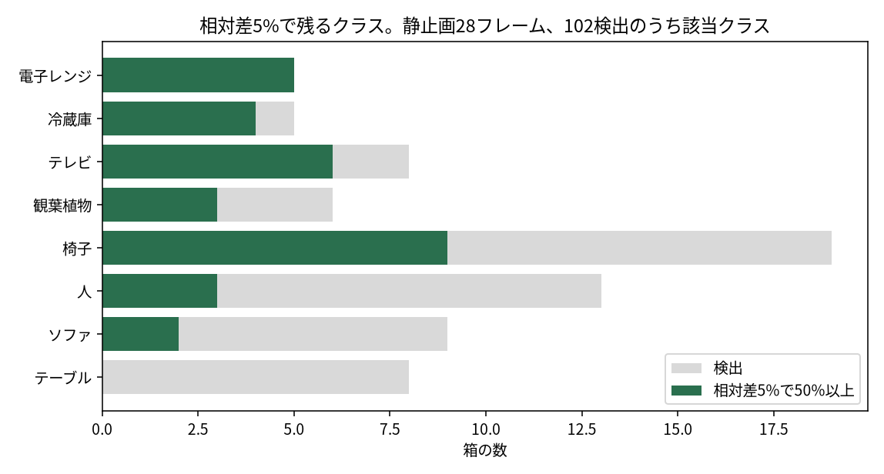
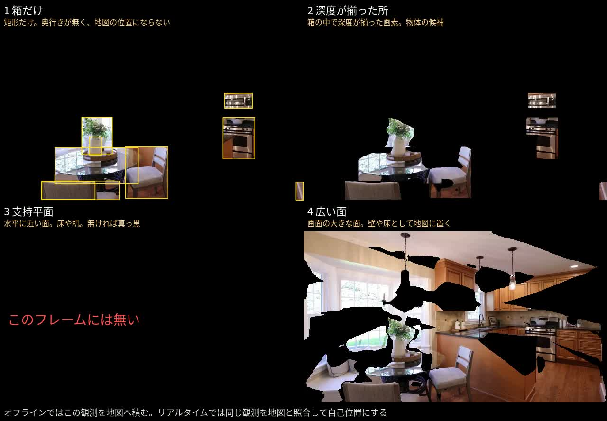
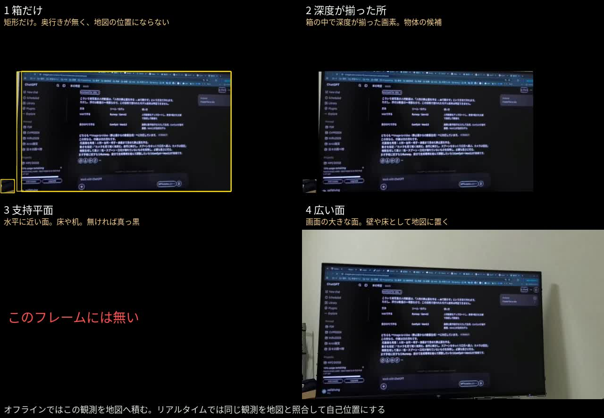
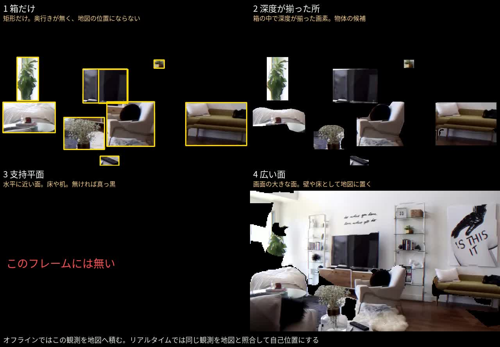
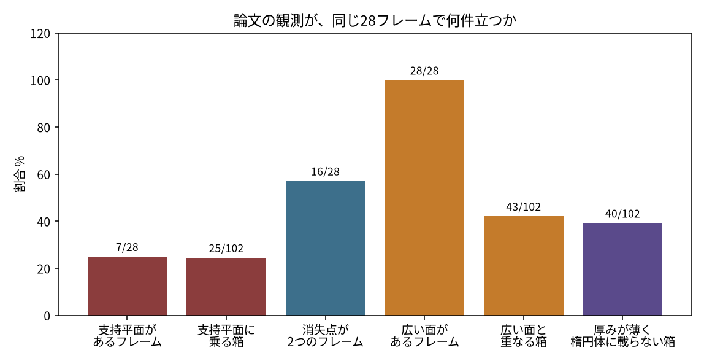

# 今回やったことのまとめ

指示は `user_directions/20261005_object_detection.md`。

## 背景

ORB-SLAM3 でも Depth Anything 3 単体でも、自己位置の精度が出ていない。欲しいのはリアルタイムの自己位置で、その前にオフラインで地図を作る。地図を作る方式とリアルタイムの方式が違うと、同じ場所を同じ観測として照合できない。

点群の地図は重い。検出した箱とも形が違う。

## 目的

オフラインとリアルタイムで同じ観測を使い、物体は位置とサイズ、壁や床は平面として YAML の地図に置く。今回の到達点は、その観測が室内映像で成立するかを測ることである。

## 仮説

- 物体検出で箱を取る。
- 箱の内側の一定以上（まず 50%）で深度がおおよそ一致したら、その画素はその物体に属する。
- 点群ではなく、YAML に位置とサイズを書く。
- 壁のような大きいものは、まず大きい平面として置き、あとでサイズを入れる。

ここでの仮説は、検出器が付けたクラスの箱の中で深度が揃った画素は、そのクラスの物体だ、という主張である。

## 比較対象

結論の各文は、次の左右を比べている。

| 結論 | 左 | 右 | 見たもの |
| --- | --- | --- | --- |
| 1 | ORB-SLAM3 の点群地図 | 今回の観測（箱、揃った深度、平面） | 地図と自己位置が同じ形か。自己位置の精度 |
| 2 | 検出器が付けたクラス | 深度が揃って残った画素 | 残った画素が、そのクラスの物体か |
| 3 | 相対差 15% で残した箱 | 相対差 5% で残した箱 | 仮説の「おおよそ一致」を狭めると、家具と家電が分かれるか |
| 4 | Liao らの支持平面で台を除いた物体 | この映像で支持平面が切れた範囲 | 台から物体を切り出せるか |
| 5 | 壁を大きい一枚の平面として置く仮置き | 画像の 12% 以上を一枚の面にした結果 | その面が壁だけか |

## 結論

ORB-SLAM3 の点群地図と、今回の箱・揃った深度・平面を比べると、観測の形は改善した。ORB-SLAM3 が出した自己位置と、今回の自己位置を比べると、今回は姿勢を解いていないので精度は改善していない。

検出器が付けたクラスと、深度が揃って残った画素を比べると、物体の識別は悪化した。残った画素はそのクラスの物体ではなく、平らな面である。

相対差 15% で残した箱と、相対差 5% で残した箱を比べると、奥行きの混ざった家具と平らな家電の切り分けは改善した。誤ったクラスの平面は改善していない。

Liao らの支持平面で台を除く切り出しと、この映像で支持平面が切れた範囲を比べると、切り出しは悪化した。台が写らないフレームがほとんどである。

壁を大きい一枚の平面として置く仮置きと、画像の 12% 以上を一枚にした面を比べると、広い面は悪化した。壁と家具が一つの面に潰れる。

## 詳細

比べた論文の観測は、QuadricSLAM の楕円体、Liao らの支持平面、CubeSLAM の消失点、Kimera の広い面である。最適化器は回していない。深度は `DA3-SMALL` の相対値で、1枚の forward は CPU で約 1.1 秒である。データは Mini 3 の保存映像と室内のネット映像 13 本。静止画は各映像 2 フレームの 28 枚。動画は Mini 3 を毎秒 1 枚、他を毎秒 2 枚で、313 フレームである。

### 1. ORB-SLAM3 の点群地図と、今回の箱・揃った深度・平面

ORB-SLAM3 の地図は特徴点の点群である。リアルタイムの検出箱とは形が違うので、同じ場所を照合できない。今回残した観測は、箱、揃った深度、平面である。オフラインが積むものと、リアルタイムが探すものを、この形に揃えた。

自己位置そのものは測っていない。姿勢も、位置とサイズを書いた世界の YAML も無い。`004_pose_and_map.md` に、その次の置き場所を書いてある。4面の動画は候補を見せているだけで、積んだあとの地図ではない。

Mini 3 の 8 秒。黒以外が、その面で残した領域である。面1の矩形には奥行きが無く、地図の位置にならない。

動画: [videos/20261002_001816_compare.mp4](videos/20261002_001816_compare.mp4)。他の12本は [INDEX.md](INDEX.md)。

### 2. 検出器が付けたクラスと、深度が揃って残った画素

仮説は、揃った画素をその物体に属させる。計測では、面が平らならクラスが間違っていても通る。ロフトではベッドが couch、棚の小物が tv や potted plant のまま緑で採用される。窓の外では、バルコニーの繰り返しが traffic light として 100% で採用される。

相対差 15% で面積 50% 以上を要求すると、静止画 99 箱中 96 箱が通る。落ちたのは、奥の廊下まで入った人と、天板と床が混ざったテーブル 2 件だけである。勾配が小さい塊が 50% 以上、という別の定義でも、動画 1133 箱中 988 箱が通る。どちらも「面が滑らかか」を見ていて、「そのクラスか」は見ていない。

左3本の分母は静止画 99 箱、右2本の分母は動画 1133 箱である。出どころは `002_bbox_depth_result.md` と `video_trials.yaml`。

### 3. 相対差 15% で残した箱と、相対差 5% で残した箱

相対差を 5% に狭めると、通過は 52/99 まで減る。ダイニングテーブルは 0/8、ソファは 2/9 で、奥行きが混ざる家具は落ちる。電子レンジは 5/5、テレビは 6/8 で、平らな家電は残る。5% で揃った 52 件のうち 45 件は、画素が一つの塊だった。

第一の山の外に 25% 以上の第二の山がある箱は 210/1133 で、15% が通した箱の約 2 割を混在として分けられる。誤ったクラスの平面は、この比較では改善していない。traffic light のような遠景は、相対差を 5% にしても一様な面のまま残る。

### 4. Liao らの支持平面で台を除く切り出しと、この映像で切れた範囲

Liao らは、水平に近い支持平面を除いた残りを物体にする。この映像では、その平面がある静止画フレームは 7/28、そこに乗る箱は 25/102 である。動画では 313 フレーム中 55 フレームしか無い。台が写らないフレームでは切り出しが始まらない。キッチンの 4 秒は、面3が真っ黒で、面2だけが椅子やレンジを残している。

動画: [videos/015_pexels_compare.mp4](videos/015_pexels_compare.mp4)

### 5. 壁を大きい一枚の平面として置く仮置きと、12% 以上を一枚にした面

仮説は、壁を仮の大きい平面として置く。Kimera の広い面を画像の 12% 以上で取ると、静止画 28/28 フレームに面があり、箱の 43/102 がその面と重なる。動画では 313/313 フレームにある。Mini 3 の 48 秒では、モニタと周囲が一つの面になる。仮置きが、家具ごと壁に吸い込む。

ロフトの 9 秒でも、面4は部屋の大半を残し、面3の支持平面は無い。面2はソファや椅子の表面だけが残るので、物体と壁を分けるなら面2の方が面4より小さい。

動画: [videos/004_8lz3Qs23cMg_compare.mp4](videos/004_8lz3Qs23cMg_compare.mp4)

楕円体（QuadricSLAM）と比べると、厚み/長辺が 0.20 未満の箱は 40/102 で、中央値は 0.24 である。薄い箱は楕円体より平面に合う。消失点が 2 つあるフレームは 16/28 で、CubeSLAM の提案に必要な直線は半数以上で立つ。今回の成否を分けているのは消失点の有無ではない。

出どころは `003_paper_verification.md`。
