# COLMAP: 疎な姿勢推定から密な表面まで

COLMAP の処理を、作者 Johannes L. Schönberger が説明したスライドに沿ってまとめた。元は CVPR 2017 チュートリアル *Large-scale 3D Modeling from Crowdsourced Data* の [Sparse Modeling](https://demuc.de/tutorials/cvpr2017/sparse-modeling.pdf)（Schönberger）と [Dense Modeling](https://demuc.de/tutorials/cvpr2017/dense-modeling.pdf)（Enrique Dunn）。公式チュートリアルが、数式込みの説明としてこの資料を指している。

調べたものの、スライドになっていないものは本文の図にはしていない。

- [COLMAP Tutorial](https://colmap.github.io/tutorial.html)。コマンドと、下の図と同じ段階分け。
- EveryPoint の [Understanding 3D Reconstruction with COLMAP](https://www.youtube.com/watch?v=EdIuDLicU0c)（57分）。Jared Heinly が同じ図を口頭で辿る。画面は会話と GUI が中心。
- Mashaan Alshammari の [Structure from Motion: From COLMAP to VGGSfM](https://www.youtube.com/watch?v=diBxFGgqAT0)（36分）。二視点幾何の式から COLMAP の初期化、登録、三角測量、バンドル調整、その後 VGGSfM。
- [Qiita: colmapを用いた3次元再構成入門](https://qiita.com/Chi_corp_123/items/17b5934802abe05175ab)。`feature_extractor` から `poisson_mesher` までのコマンド。
- Fixstars の [Multi-View Stereo の CUDA 高速化](https://docswell.com/s/fixstars/KV1V62-20240807)。COLMAP はライブラリ比較の一行で、本題は PatchMatch。

81枚と103枚のうち、段階が変わる17枚を残した。

COLMAP がやることは二つに分かれる。SfM は画像の集まりからカメラ姿勢と疎な点を出す。MVS はその姿勢を既知として、画素ごとの深度を面に融合する。既定の SfM は incremental で、MVS の密な深度は PatchMatch と画素ごとの視点選択である。

## 全体の流れ

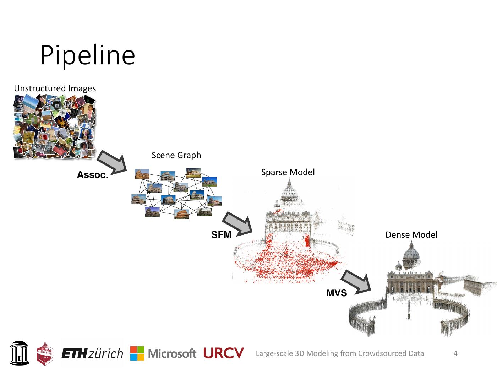

順序のない画像から始める。対応づけでシーングラフを作り、SfM で疎なモデル（赤い点とカメラ）を出し、MVS で表面の密なモデルにする。COLMAP の GUI と CLI は、この矢印をモジュールに分けている。

## 対応づけは三段階

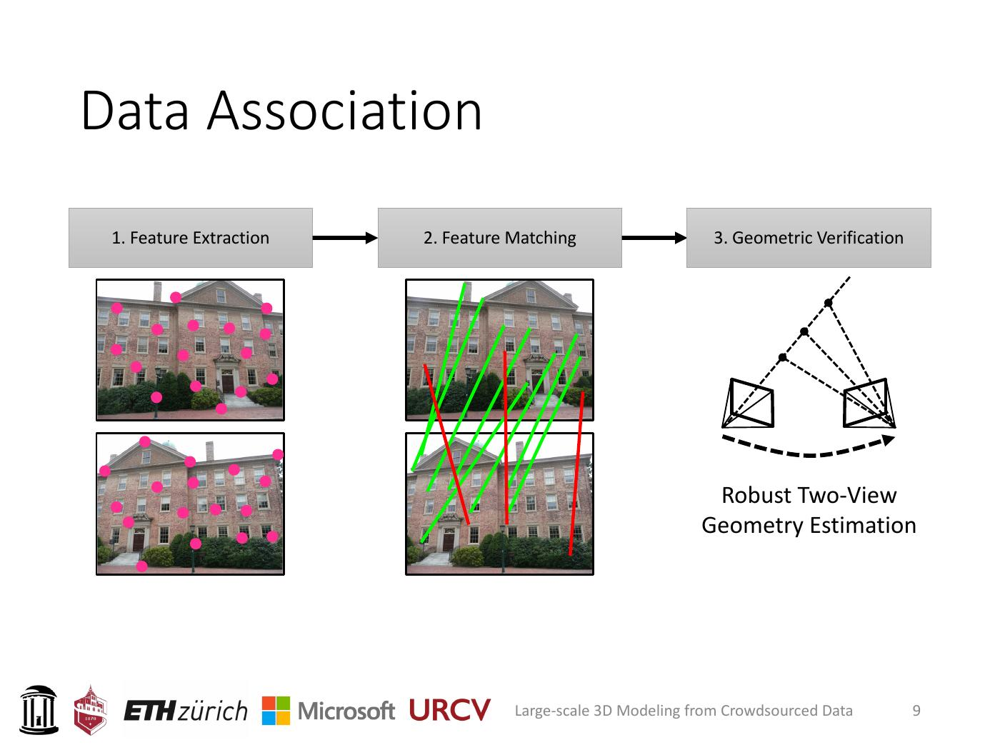

シーングラフの枝は、次で作る。

1. 特徴抽出。COLMAP の既定は SIFT で、コントラストの強い点を各画像から取る。
2. 特徴マッチング。画像対で記述子が近い点をつなぐ。全対は `exhaustive_matcher`、順序がある映像は `sequential_matcher`、枚数が多いときは語彙木。
3. 幾何検証。つながった点が一つのカメラ運動で説明できるかを RANSAC で確かめ、外れ値（図の赤）を落とす。残ったインライア（緑）が二視点の幾何。

ここまででは、まだ絶対的な 3 次元座標はない。あるのは「どの画像とどの画像が、どの点を共有しているか」である。

## 二視点のモデルを場合分けする

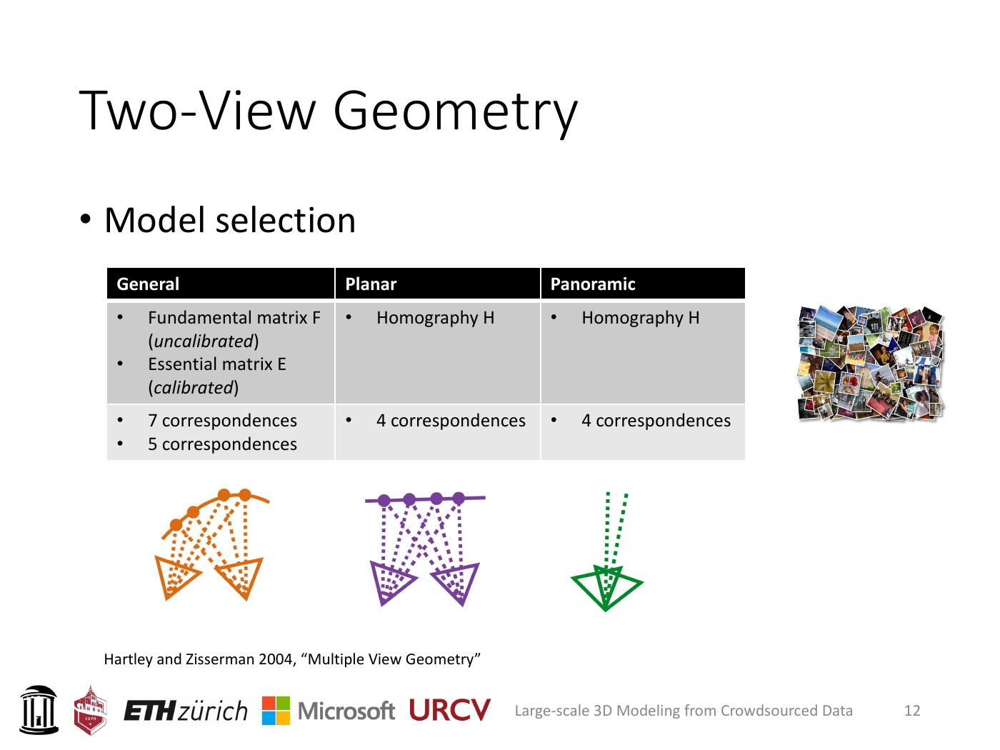

検証に使うモデルは、カメラの動きで違う。

- 一般の運動で未校正なら基礎行列 F（点は7個）。校正済みなら基本行列 E（点は5個）。E から相対回転と並進の方向が出る。
- 平面を見ている、またはカメラがほぼ回転だけならホモグラフィ H（点は4個）。並進がほぼゼロのパノラマは、三角測量しても奥行きが決まらない。

COLMAP は F、E、H を比べ、その画像対に合うものを残す。初期ペアからは、パノラマ（並進がゼロ）を外す。

## SfM の三つの組み方

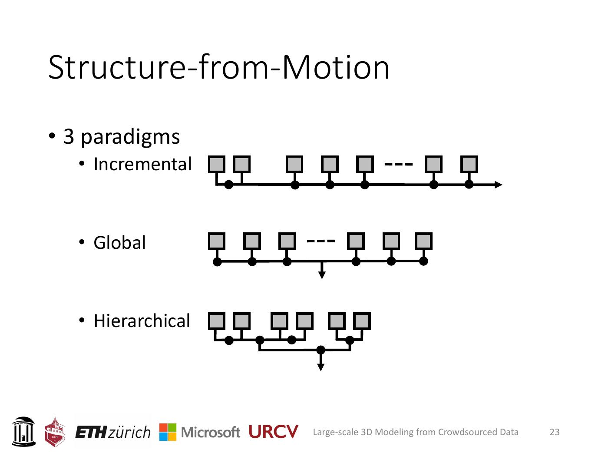

相対姿勢の集まりを、一つの座標系のカメラと点にする方法は三つある。

- Incremental は、良い二枚から始めて一枚ずつ足す。COLMAP の `mapper` はこれ。
- Global は、全部の相対回転を先に一つの回転へ解き、その後に並進を解く。
- Hierarchical は、シーングラフをクラスタに分け、クラスタごとに解いてから結合する。

## 再投影誤差を同時に下げる

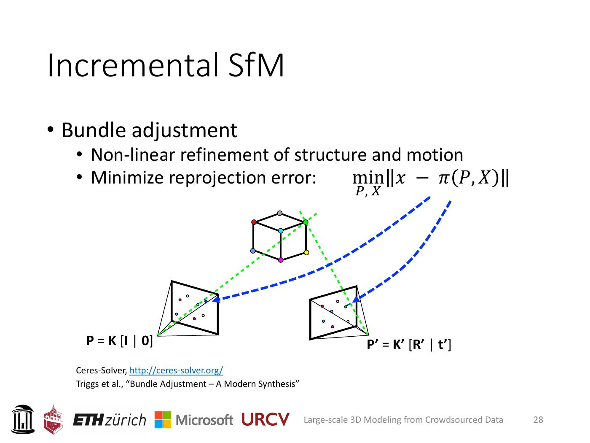

点 \(X\) をカメラ \(P\) で投影した位置と、実際に検出した点 \(x\) の差が再投影誤差。バンドル調整は、カメラと点をまとめて動かして、この差の和を小さくする非線形最小二乗。COLMAP は Ceres を使う。二枚だけの初期化のあとだけでなく、カメラを足すたび、およびモデルが大きくなったときに回す。

## Incremental の中身

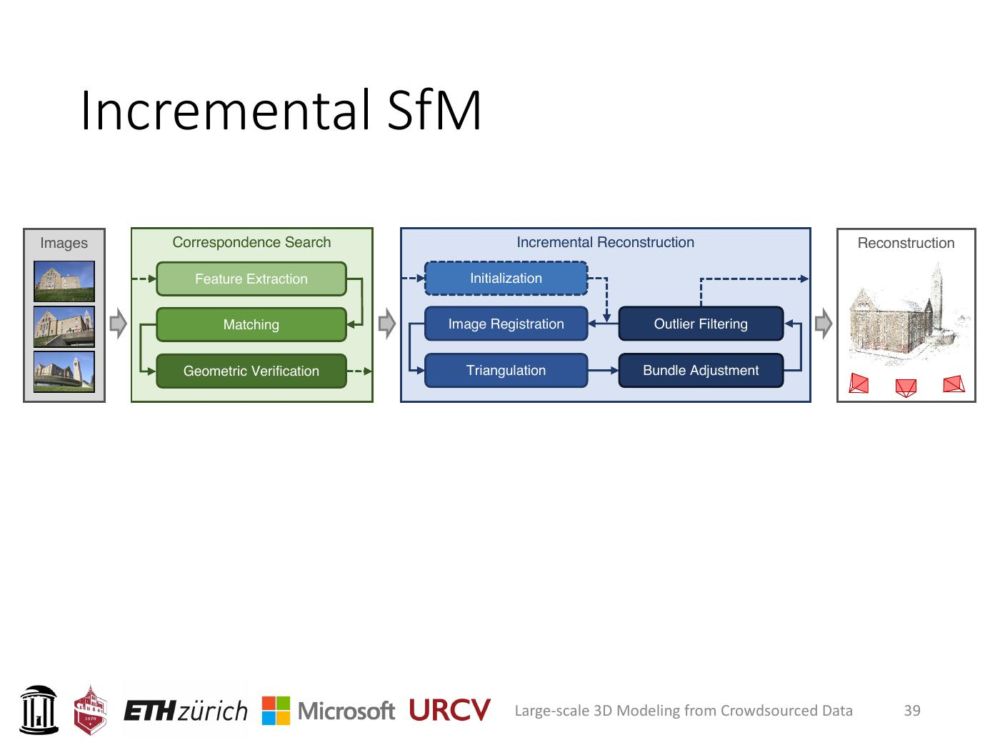

COLMAP の図そのもの。左が対応探索、中央が増分再構成、右が疎な再構成。

初期化のあと、繰り返すのは次の四つ。

- Image registration。既存の 3 次元点が見えている次の画像を選び、2D-3D 対応からそのカメラの姿勢を解く。点とカメラが校正済みなら、最小では 3 点の P3P。
- Triangulation。新しい画像と、すでに入っている画像の対応から、まだ無い 3 次元点を作る。
- Bundle adjustment。入ったばかりのカメラのまわりを局所的に整え、ときどき全体も整える。
- Outlier filtering。再投影誤差が大きい点を捨てる。

一枚足すたびにモデル全体を解き直すと、枚数が増えるほどこの調整が支配的になる。次のスライドは、その回数を減らすスケジュールを示している。

## 最初の二枚の選び方

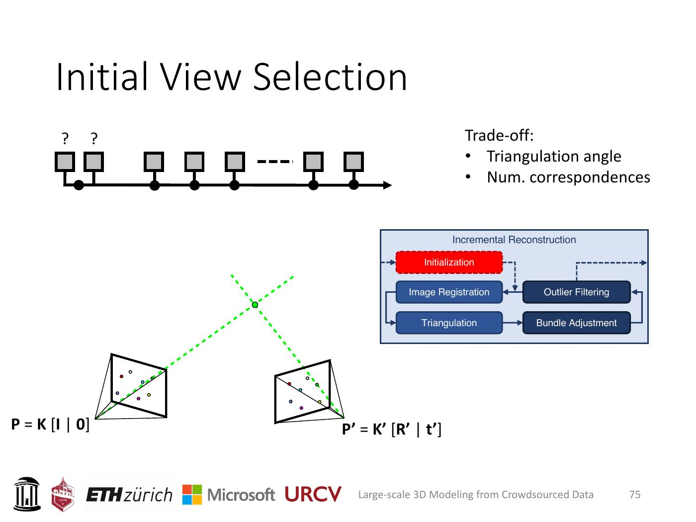

最初の対は、見えている点の数と、二カメラのなす角の両方を見る。点がたくさんあっても、ほぼ同じ方向から撮っていると奥行きが不安定になる。角が大きくても、共通点が少ないと姿勢が決まらない。並進がゼロの対はここでは落とす。

## 三方式の比較

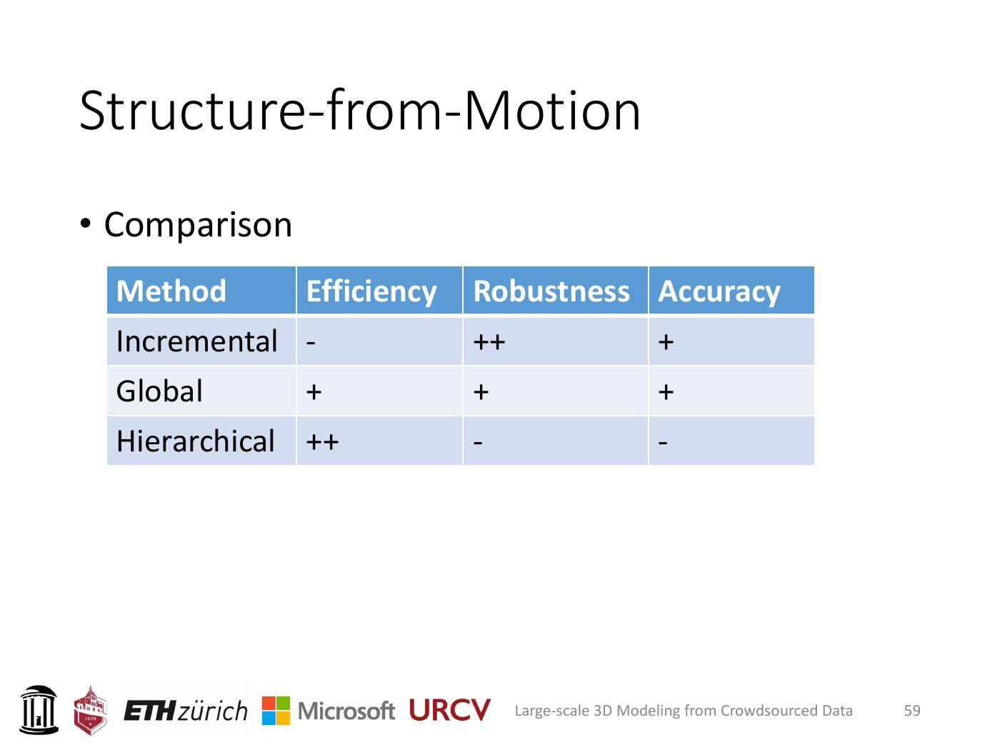

スライドの評価は、incremental が頑健さに強く精度も良い一方、効率は劣る。global は効率と頑健さと精度がいずれも中程度。hierarchical は効率が高いが、頑健さと精度は劣る。インターネット写真のように外れ値の対が多いとき、COLMAP が incremental を採る理由はこの表の頑健さにある。

## 単眼の SfM にメートルは無い

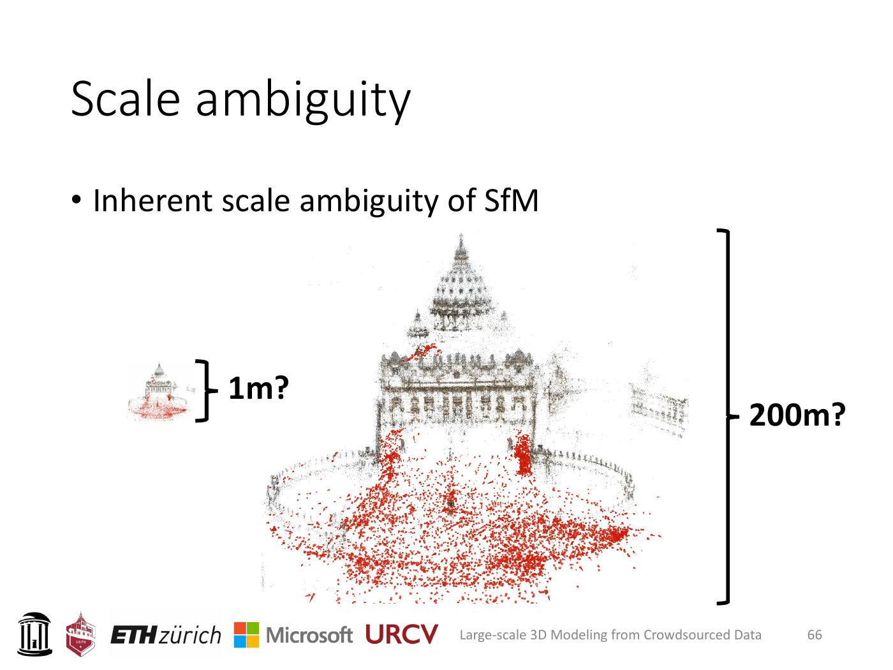

画像だけでは、同じ形のまま全体を拡大しても投影は変わらない。スライドは同じ点群が 1 m にも 200 m にも見える、と書いている。GPS の EXIF や、既知の大きさで後から尺度を付ける。ドローンの単眼映像を COLMAP に入れても、この段階の点群はメートルではない。

## 全体はときどきだけ解く

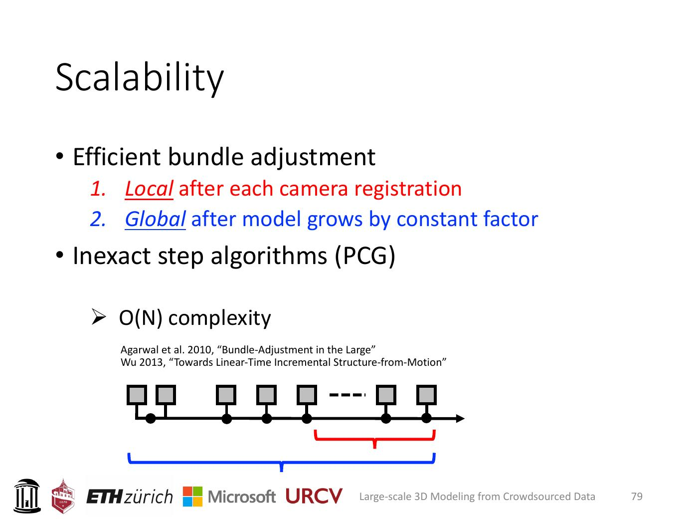

スライドのスケジュールは二つ。カメラを登録するたびに、そのカメラの近傍だけを局所調整する。モデルの大きさが一定の割合で増えたときに、全体を調整する。大規模な求解には非厳密な反復（PCG）を使い、カメラ数 \(N\) に対して \(O(N)\) だと書いている。引用は Agarwal らの大規模バンドル調整と、Wu の線形時間 incremental SfM。図の赤線が局所、青線が全体。

## 実装が COLMAP

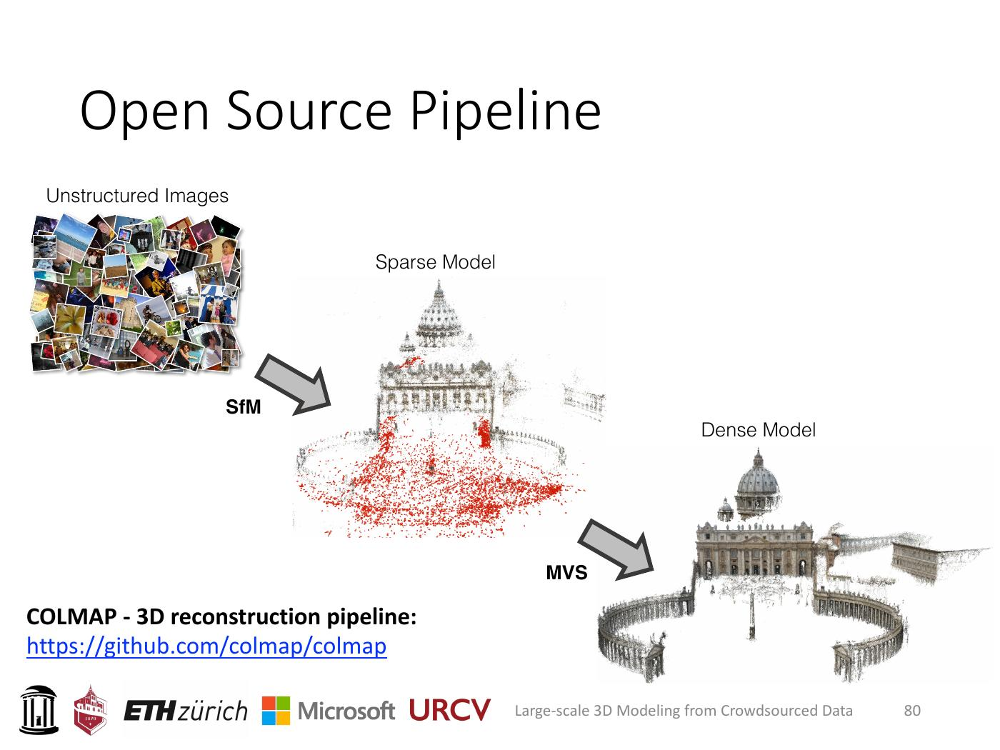

この疎な SfM と、次の密な MVS を一つのソフトにしたのが COLMAP（[github.com/colmap/colmap](https://github.com/colmap/colmap)）。論文は Schönberger と Frahm の *Structure-from-Motion Revisited*（CVPR 2016）と、Schönberger らの *Pixelwise View Selection for Unstructured Multi-View Stereo*（ECCV 2016）。

## 密なモデルが埋めるもの

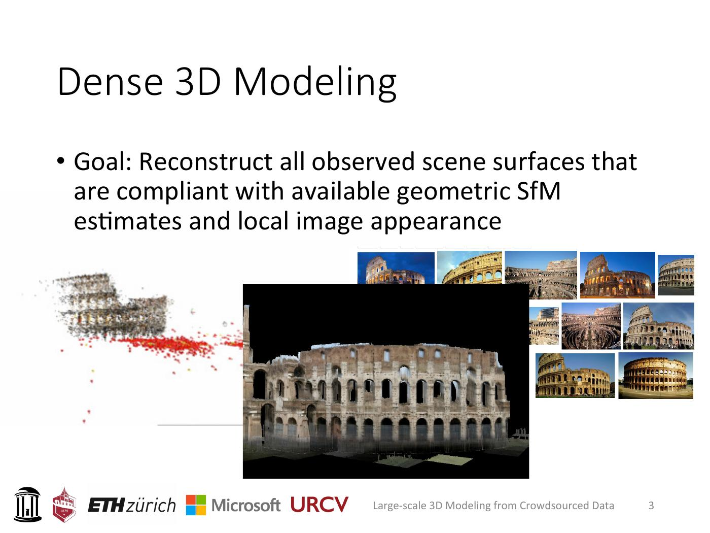

SfM の赤い点は角だけなので、壁は穴になる。密なモデルの目的は、SfM の幾何と、画像の見た目の両方に合う表面を、見えている範囲について復元すること。入力は画像と、SfM が決めたカメラ姿勢。

## 姿勢が分かれば、深度は対応点の探索になる

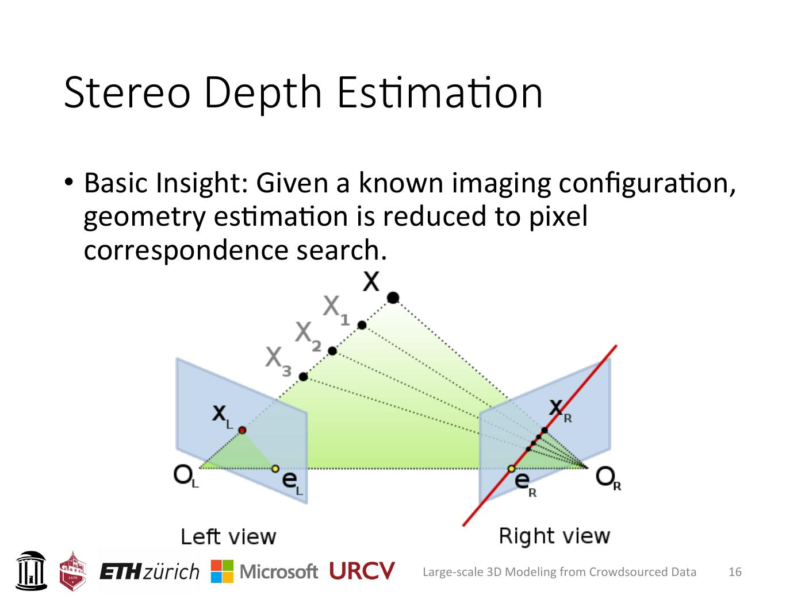

カメラの位置と向きが既知なら、左画像の点に対応する右画像の点はエピポーラ線上だけを探せばよい。その線上の位置が深度になる。COLMAP の MVS は、特徴点ではなく画素についてこの探索をする。

## 全深度を総当たりしない

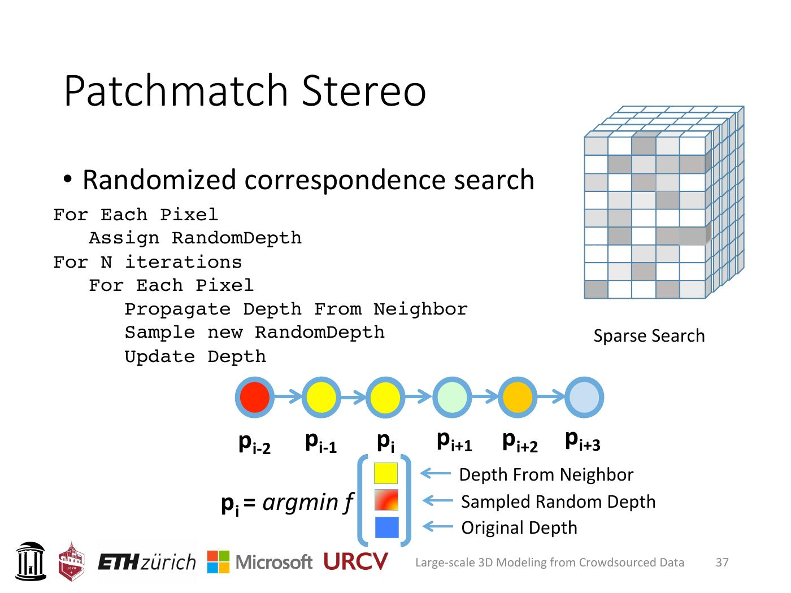

深度を細かく全部試すと、画素数かける深度の段数だけコストが要る。PatchMatch は各画素にランダムな深度を置き、反復で隣の深度を伝播し、新しいランダム深度も試し、コストが小さい方を残す。隣り合う画素は同じ面に乗っていることが多いので、疎な試行でも面が広がる。COLMAP の `patch_match_stereo` がこの探索で、画素ごとの深度に加えて法線も出す。融合の入力は、その深度と法線である。

## どの画像と比べるかを画素ごとに選ぶ

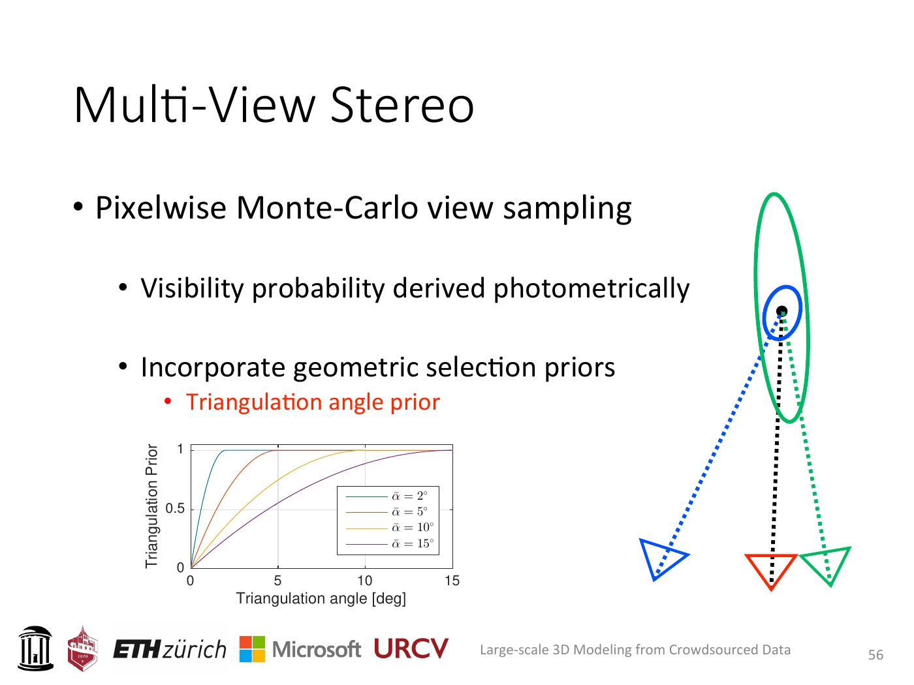

密な深度では、参照画像の各画素をシーン中のどの写真と比べるかが結果を左右する。隠れ、反射、露出の違いで、近くの写真がいつも正しい比較相手ではない。COLMAP の MVS は、画素ごとに比較する視点をモンテカルロで選び、見た目から可視らしさを出し、三角測量の角度も事前分布に入れる。角度が小さすぎる対は奥行きが不安定なので、事前分布がそれを抑える。この視点選択が ECCV 2016 の論文の主題で、固定の上位 K 枚と比べる方法との差として示している。

## 深度画像を一つの点群にする

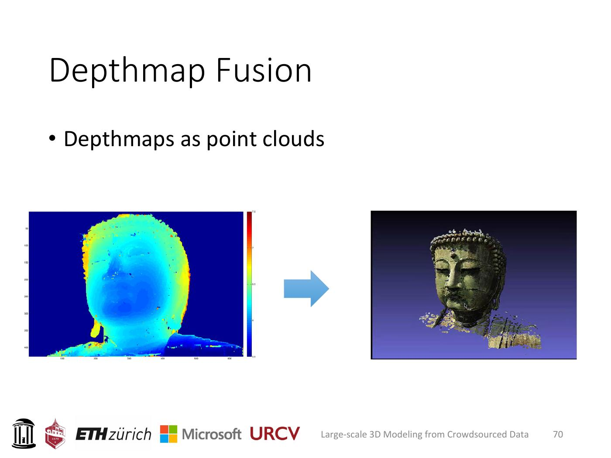

各画像の深度は、そのカメラから見た点群である。同じ表面を複数の深度が別々に持つので、3 次元で一致するものを残し、一つの視点からしか支持されない点を落とす。`stereo_fusion` がこの融合で、出力が密な点群（`fused.ply`）になる。

## 点と法線から表面にする

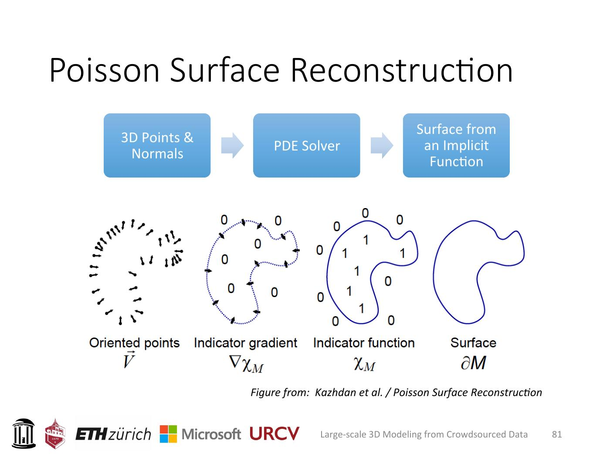

融合した点は、向き（法線）を持っている。Poisson 表面復元は、その法線を指示関数の勾配とみなし、偏微分方程式を解いて、中と外を分ける曲面を出す。図は Kazhdan らの論文からで、COLMAP の `poisson_mesher` がこれ。公式チュートリアルでは、Delaunay や advancing front のメッシュ、その後の簡略化とテクスチャ貼りも選べる。

## 公式チュートリアルのコマンド順

スライドの矢印を CLI にすると、次の順になる。

```bash
colmap feature_extractor --database_path database.db --image_path images
colmap exhaustive_matcher --database_path database.db
colmap mapper --database_path database.db --image_path images --output_path sparse
colmap image_undistorter --image_path images --input_path sparse/0 --output_path dense
colmap patch_match_stereo --workspace_path dense --workspace_format COLMAP
colmap stereo_fusion --workspace_path dense --workspace_format COLMAP --output_path dense/fused.ply
colmap poisson_mesher --input_path dense/fused.ply --output_path dense/meshed-poisson.ply
```

`mapper` までが疎な SfM。`patch_match_stereo` 以降が密な MVS で、ここが GPU と時間を使う。
