# Depth Anything V2: 単眼深度推定の解説と実時間デモ

Kevin Wood 氏の解説動画。元動画は [YouTube](https://www.youtube.com/watch?v=fs0jZx9o9rc)（13分32秒）。

5秒ごとに画面を切り出し、同じスライドが続いている区間と、実時間デモで物体を動かしているだけの区間は省いてある。右下に映るのは話者。チャンネルのオープニングと終了画面は内容がないので入れてない。

この動画の流れは次のとおり。

1. Depth Anything V2 が何を良くしたか
2. 実写ラベルの問題と、合成データの限界
3. 教師モデルで擬似ラベルを作り、小さい生徒モデルを学習する
4. 反射、透明、細い構造での比較
5. ウェブカメラでの実時間デモ

## 00:00:00 論文とリポジトリ

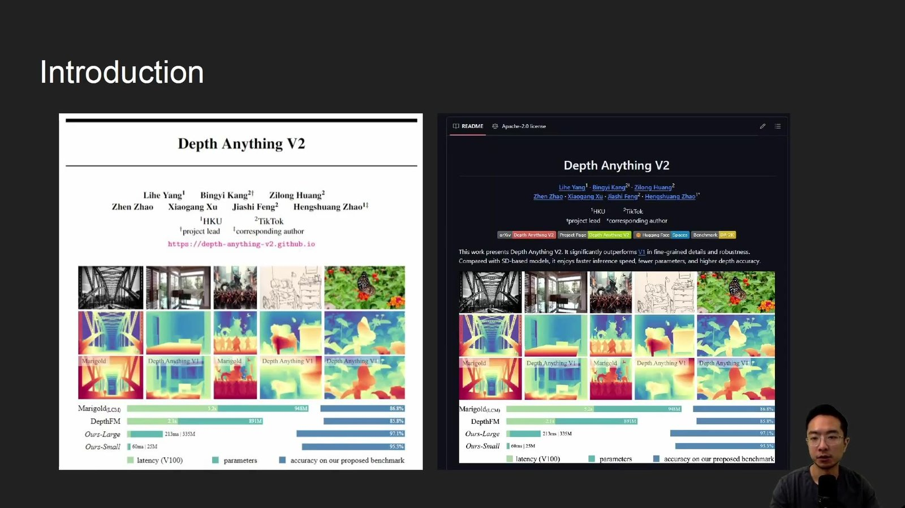

左が Depth Anything V2 の論文、右がその GitHub（`depth-anything-v2`、Apache-2.0）。著者は Lihe Yang らで、所属は HKU と TikTok。図は橋や植物の深度を Marigold、Depth Anything V1、V2 で比べ、下の棒グラフは遅延、パラメータ数、提案ベンチマークでの精度を Marigold、DepthFM、V2 の Large と Small で並べている。話の出発点は、細かい形状と頑健さを V1 より上げつつ、拡散モデルより軽くする、という主張。

## 00:00:15 MiDaS から続く深度マップ

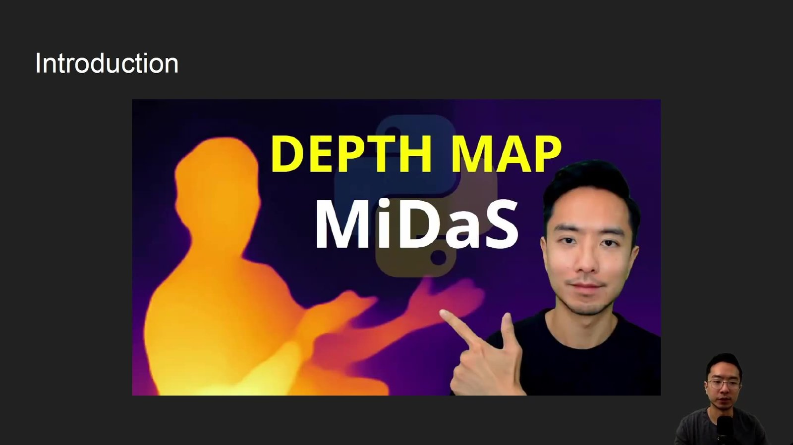

人物のシルエットを深度の色で塗ったタイトル。単眼深度の一般的な作りとして MiDaS 系の相対深度マップを示している。このあと V2 は、この種のマップをどう学習し直すかの話になる。

## 00:00:25 この動画の目次

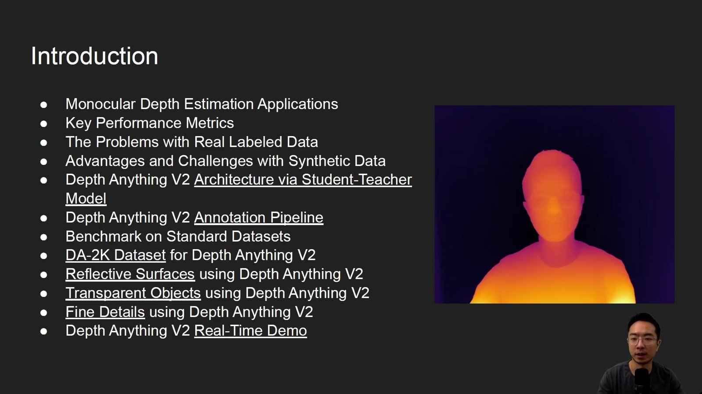

扱う項目は次のとおり。

- 単眼深度の用途
- 評価したい性質
- 実写ラベルの問題
- 合成データの利点と課題
- Student-Teacher の構造
- 注釈パイプライン
- 標準データセットでのベンチマーク
- DA-2K
- 反射面、透明物体、細かい構造
- 実時間デモ

右は人の顔の深度。近いところほど暖色、という色づかいが以降の図でも共通。

## 00:01:15 単眼深度の用途

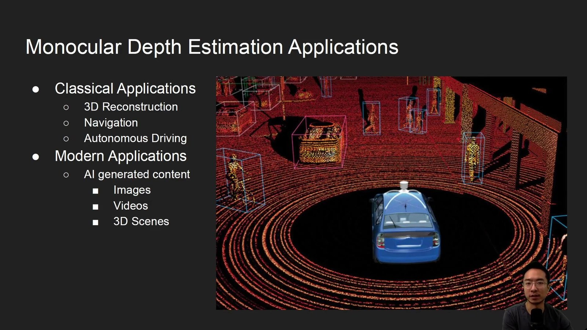

古典的な用途は 3 次元復元、ナビゲーション、自動運転。新しい用途は、画像、動画、3 次元シーンを含む AI 生成。右は車の周囲を点群と枠で示した走行シーンで、単眼の深度が周囲の立体を埋める材料になる、という絵。

## 00:01:35 強いモデルに求める性質

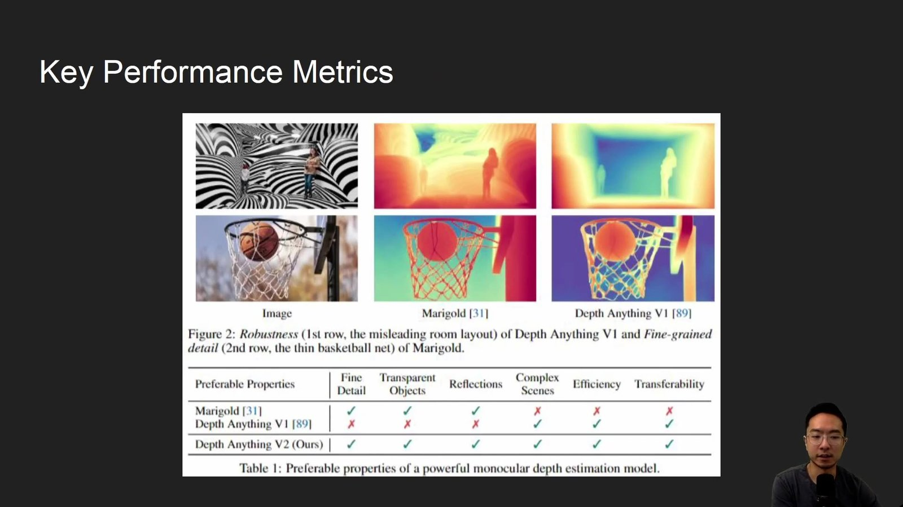

上段は、縞模様の部屋で Marigold が奥行きを誤ることと、Depth Anything V1 がその部屋の形を保つこと。下段はバスケットの網で、Marigold の方が細い構造を残すこと。表が求める性質は、細かい形状、透明物体、反射、複雑な場面、計算効率、他の場面への転用。Marigold は細かい形状と透明と反射に印があり、効率と転用にはない。V1 はその逆に近い。V2 は六項目すべてに印がある、という整理。

## 00:02:30 実写の深度ラベルが悪い理由

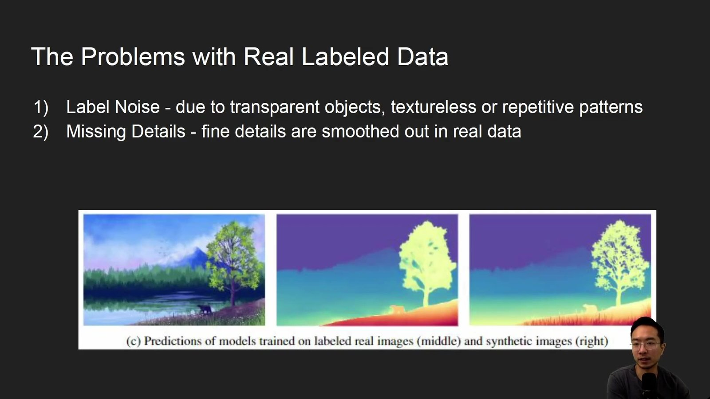

実写ラベルの問題は二つ。透明なもの、模様がない面、繰り返し模様でラベルが汚れること。細かい形が実測深度のなかで滑らかに消えること。図は同じ風景で、実写ラベルで学習した予測（中央）は木が塊になり、合成データで学習した予測（右）は枝まで残る。

## 00:03:25 合成データは細部が正しいが、実写と分布が違う

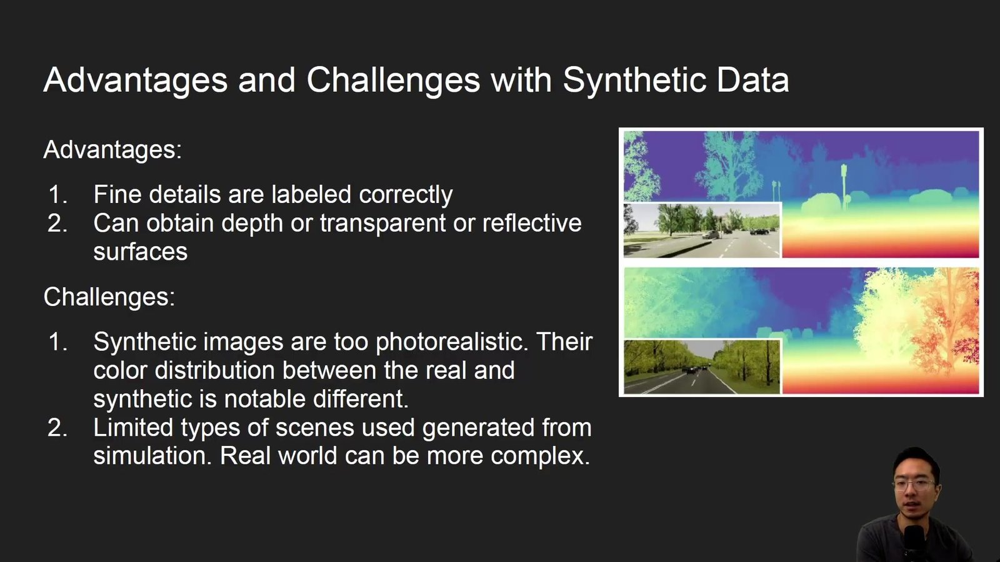

利点は、細かい形状に正しい深度が付くことと、透明面や反射面の深度も得られること。課題は、合成画像と実写で色の分布が違うことと、シミュレータが作れる場面の種類が限られ、現実の方が複雑であること。右は道路と並木の合成画像と、その深度。

## 00:04:55 大きい教師で擬似ラベルを作り、小さい生徒を学習する

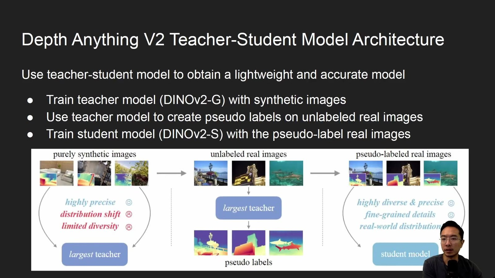

教師生徒の三段。教師（DINOv2-G）は合成画像だけで学習する。精度は高いが、色の分布が実写とずれ、場面の多様性は少ない。その教師で、ラベルのない実写に擬似深度を付ける。生徒（図では DINOv2-S）はその擬似ラベル付き実写で学習する。ねらいは、実写の分布と細かい形状を、軽いモデルに残すこと。後の表では S だけでなく B、L、G も比較している。

## 00:06:10 モデルが割れた点だけ人に聞く

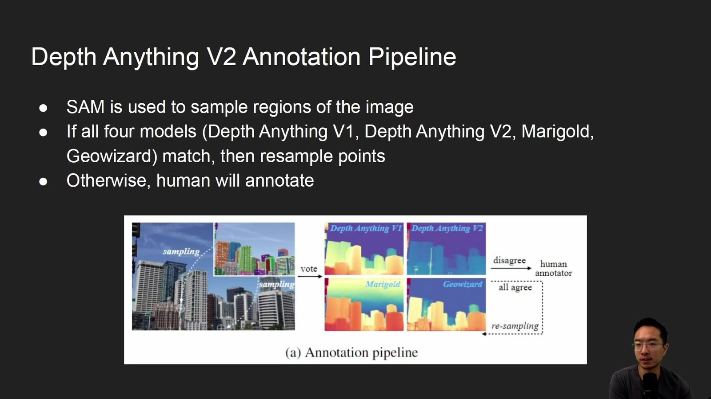

擬似ラベルをそのまま信じないための注釈。SAM で画像の領域を拾う。Depth Anything V1、V2、Marigold、GeoWizard の四つに深度を出させ、一致しない点は人が注釈する。図では、全員が一致した点は採用して次のサンプリングへ戻る。

## 00:06:40 標準データセットでの数値

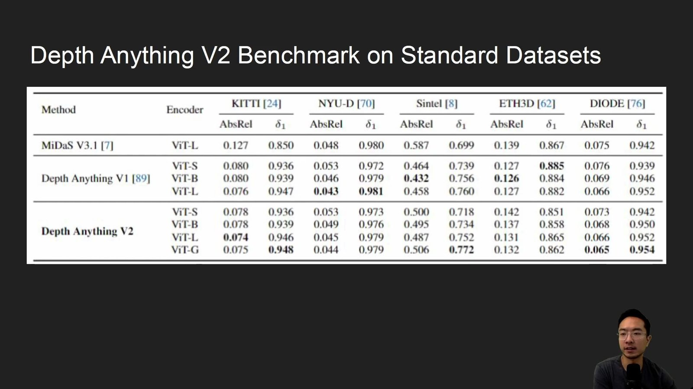

KITTI、NYU-D、Sintel、ETH3D、DIODE について AbsRel と δ1 を並べている。AbsRel は小さいほどよく、δ1 は大きいほどよい。比較は MiDaS V3.1、Depth Anything V1、Depth Anything V2 で、V2 は ViT-S、B、L、G。スライド上、V2 の ViT-L は KITTI で AbsRel 0.074、δ1 0.946。屋外の KITTI と屋内の NYU では V2 が上位に入り、動画の Sintel や ETH3D ではデータセットごとに勝敗が分かれる、という表。

## 00:07:15 難しい場面を集めた DA-2K

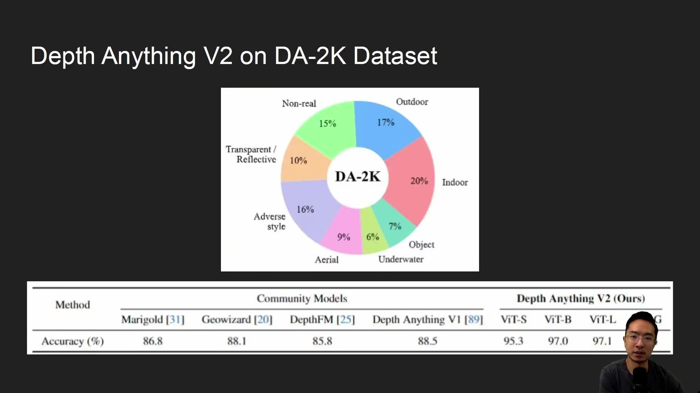

DA-2K の内訳は、室内 20%、屋外 17%、adverse style 16%、非実写 15%、透明・反射 10%、空撮 9%、物体 7%、水中 6%。下の精度は、Marigold 86.8%、GeoWizard 88.1%、DepthFM 85.8%、Depth Anything V1 88.5% に対し、V2 は ViT-S 95.3%、ViT-B 97.0%、ViT-L 97.1%。標準データセットより、この多様なペア比較で差が開いている。

## 00:08:15 反射面

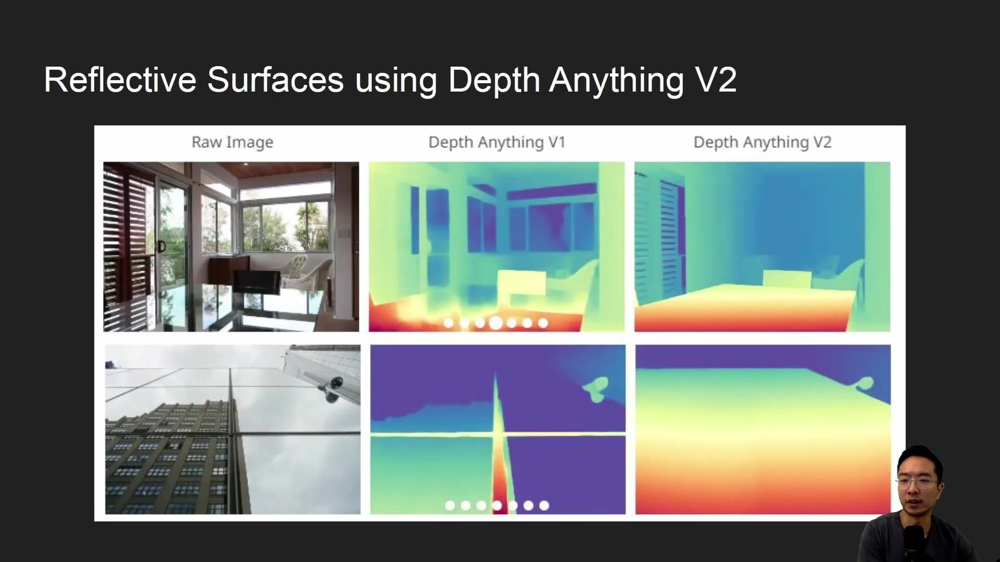

ガラス戸の室内と、ガラス張りの建物。V1 は窓枠や反射に引きずられて面が割れ、V2 は床、壁、ガラスの奥行きが面としてつながる。反射を奥の物体と取り違えにくい、という比較。

## 00:09:00 透明な物体

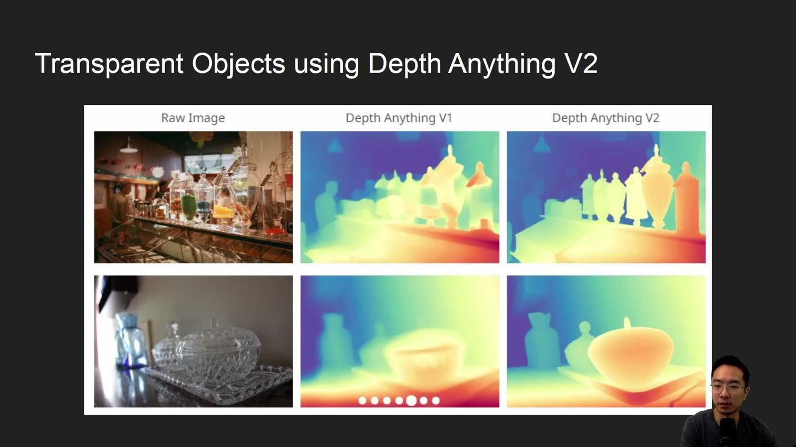

店先のガラス瓶と、ガラスの器。V1 は瓶の輪郭が溶け、器も塊になる。V2 は瓶の並びと器の縁が残る。透明でも、見えている輪郭から手前の物体として深度を付けている。

## 00:09:50 細い構造

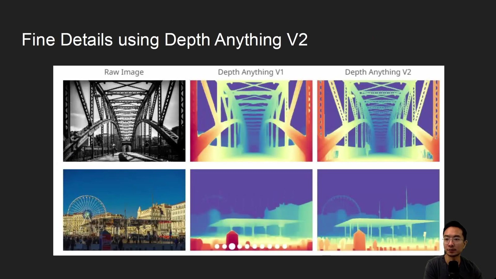

鉄橋のトラスと、観覧車のある広場。V1 は橋の部材が太く潰れ、観覧車はほぼ消える。V2 はトラスの格子と観覧車の輪が残る。00:01:35 で Marigold が網を残し V1 が潰していた性質を、V2 が取りにいっている場面。

## 00:10:35 実時間デモ

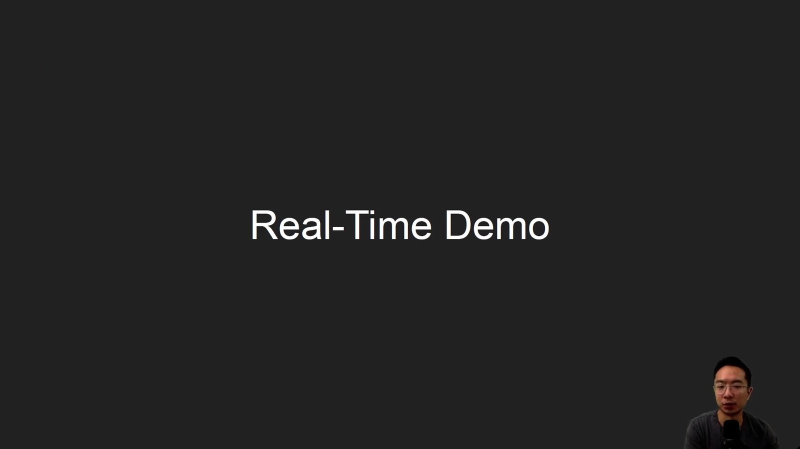

ここからウェブカメラの実時間デモ。以降、同じ画面で物体を差し替えているだけのフレームは省いた。

## 00:10:40 カメラ映像と深度を並べる

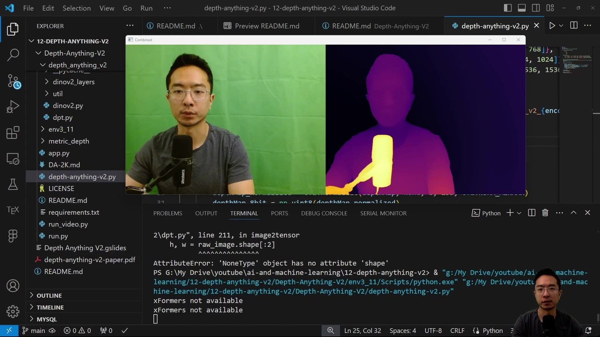

Visual Studio Code で `depth-anything-v2.py` を開いている。左が緑背景のカメラ、右がその深度。マイクと手前の明るい物体が暖色で手前に出る。ターミナルには `image2tensor` の `AttributeError` と、`xFormers not available` が残っている。深度の窓は更新されているので、表示中の推論自体はこのエラーで止まっていない。

## 00:11:15 黒い円筒は形が残る

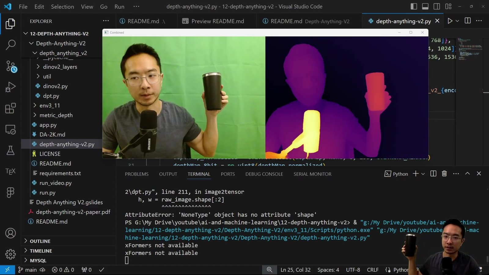

模様のない黒いタンブラーを上げると、深度では手前の面として円筒の形が残る。色が暗くても、輪郭とカメラとの位置関係から距離を付けている。同じデモの途中で見せる明るいカップも、同様に手前の物体として暖色になる。

## 00:11:45 ガラス瓶は塊になる

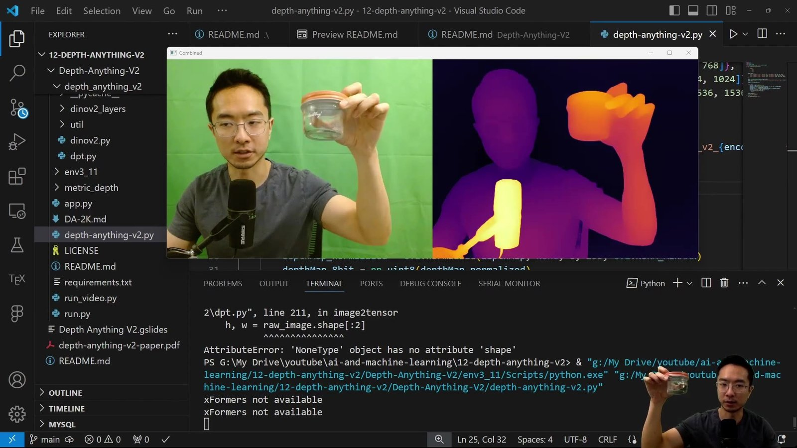

小さなガラス容器をカメラに近づけると、深度は透明な厚みではなく、手と一体の塊として塗る。スライドの比較画像より、この実時間の小さい瓶では中身と縁が分離していない。

## 00:12:40 キーボードは平面になり、キーは残らない

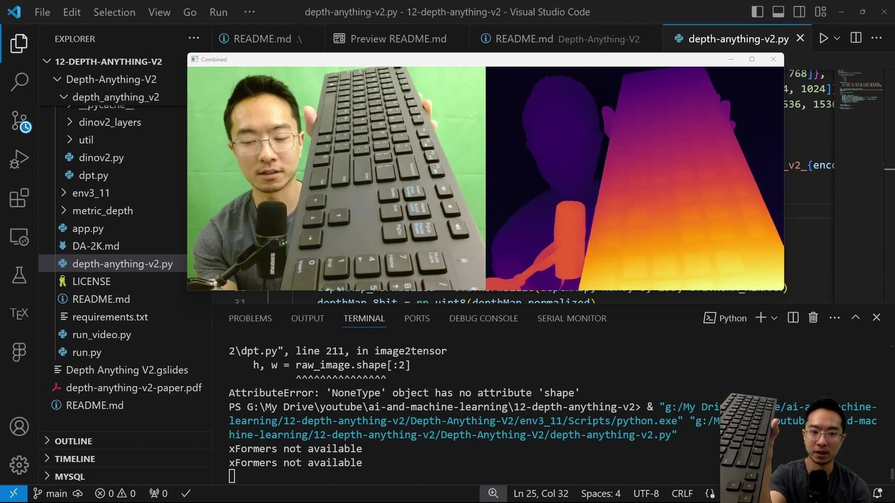

キーボードを斜めに向けると、全体の平面と、カメラに近い側が暖色になることは追える。個々のキーの段差は深度に出ていない。スライドで残っていた鉄橋の部材より、この距離の細かい凹凸は実時間のこの設定では落ちる。
