# Chapter 13: Pose Graph Optimization と ORB-SLAM

Saeed Saeedvand 氏の講義 *SLAM for Robotics* 第13章。元動画は [YouTube](https://www.youtube.com/watch?v=D_Lm7NitBoA)（2時間11分15秒）。

5秒ごとに画面を切り出し、スライドが止まっている区間や、同じ図の途中フレーム、一度戻っただけのスライドは省いてある。右上の小窓は教室のプロジェクタ映像で、本文は大きい方のスライドを見れば足りる。教室をカメラで撮っているデモ区間だけ、その映像をそのまま残している。

この章の流れは次のとおり。

1. 誤差がない地図と、誤差がある地図の違い
2. 姿勢のグラフを作って、ループを閉じ、全体を最適化する
3. SIFT、BRIEF、ORB で画像の特徴を取る
4. Bundle Adjustment と共視グラフ
5. ORB-SLAM の三つのスレッドと、版ごとの違い

## 00:00:00 章の表紙

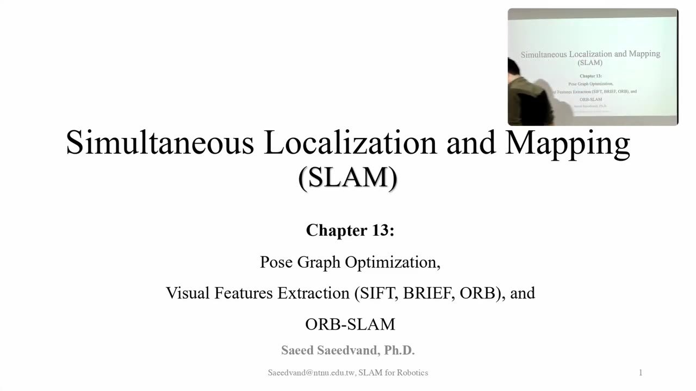

第13章のタイトル。扱うのは Pose Graph Optimization、視覚特徴（SIFT、BRIEF、ORB）、そして ORB-SLAM。講演者は Saeed Saeedvand。

## 00:01:10 この章でやること

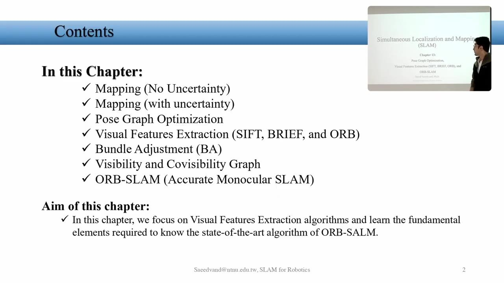

目次は六項目。誤差なしの地図、誤差ありの地図、ポーズグラフ、視覚特徴、Bundle Adjustment、Visibility / Covisibility Graph、最後に ORB-SLAM。狙いは、特徴抽出のアルゴリズムと、現在の単眼 SLAM を理解するための部品を押さえること。

## 00:02:30 Online SLAM と Full SLAM

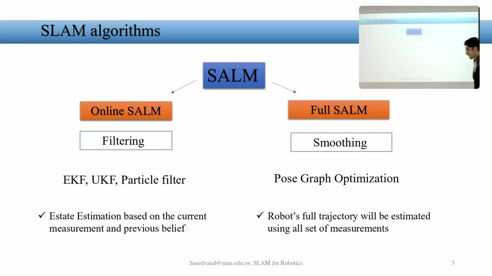

SLAM は二つに分かれる。

Online SLAM はフィルタリング。EKF、UKF、パーティクルフィルタのように、今の計測と直前の信念だけから現在の状態を更新する。過去の軌跡は保持しない。

Full SLAM はスムージング。全部の計測を使って軌跡全体を推定する。その実装がポーズグラフ最適化。この章の本体はこちら。

## 00:04:40 誤差がないときの地図

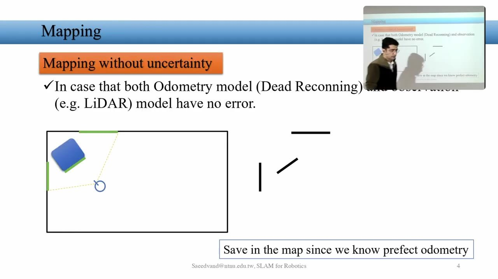

オドメトリ（デッドレコニング）も LiDAR も誤差がない、という理想の場合。ロボットが測った壁はそのまま地図に書き込める。左がロボットと真の壁、右がセンサが返した線分。

## 00:05:55 誤差がなければ計測はぴったり重なる

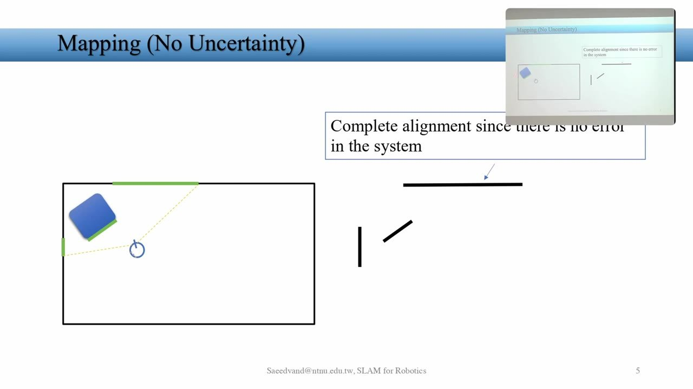

ロボットが壁に沿って進んでも、オドメトリが正しければ新しいスキャンは既存の壁と完全に一致する。スライドの文言は “Complete alignment since there is no error in the system”。

## 00:06:30 一周しても地図は閉じる

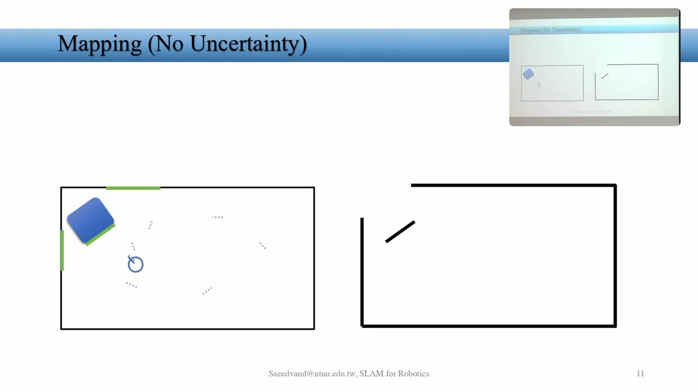

同じ仮定のまま矩形の壁を一周した終わり。推定した壁（右）が真の矩形（左）と一致する。途中のコマは同じ演示なので省いた。誤差がゼロなら、計測を積み上げるだけで地図になる。

## 00:06:40 現実にはオドメトリがずれる

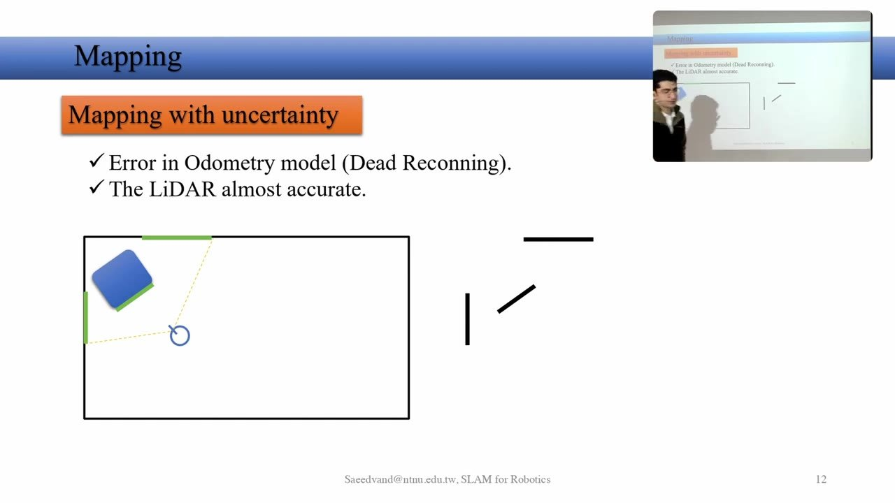

ここから誤差あり。オドメトリはデッドレコニングなので積分誤差が乗る。LiDAR 自体はほぼ正確、という設定。問題はセンサではなく、ロボットが「自分はどこにいるか」を間違えること。

## 00:07:20 推定姿勢が真の姿勢から離れる

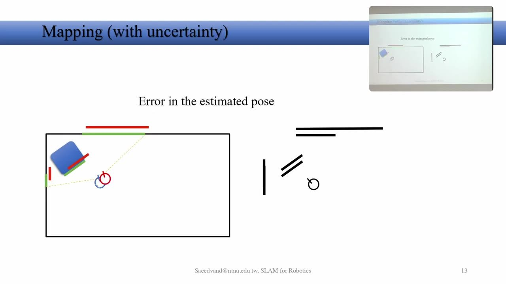

青が真の姿勢、赤が推定姿勢。位置がずれているのに計測をその姿勢へ貼ると、同じ壁が二重に描かれる。右の黒い線が、ずれたスキャン。

## 00:08:15 計測をそのまま地図にできない

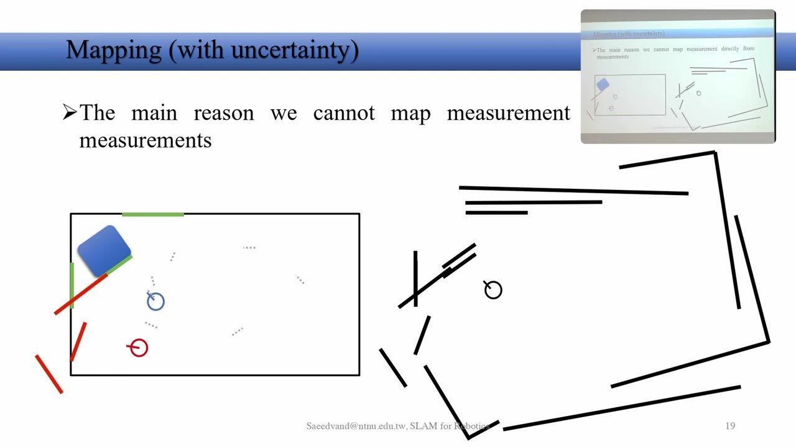

角を曲がるころには推定軌跡が大きく曲がり、壁の断片がばらばらになる。スライドの結論は、計測を直接地図へ書き込めない、ということ。途中のコマは同じずれの進行なので省いた。このずれを後から直すのがポーズグラフ。

## 00:09:20 SLAM をグラフで書く

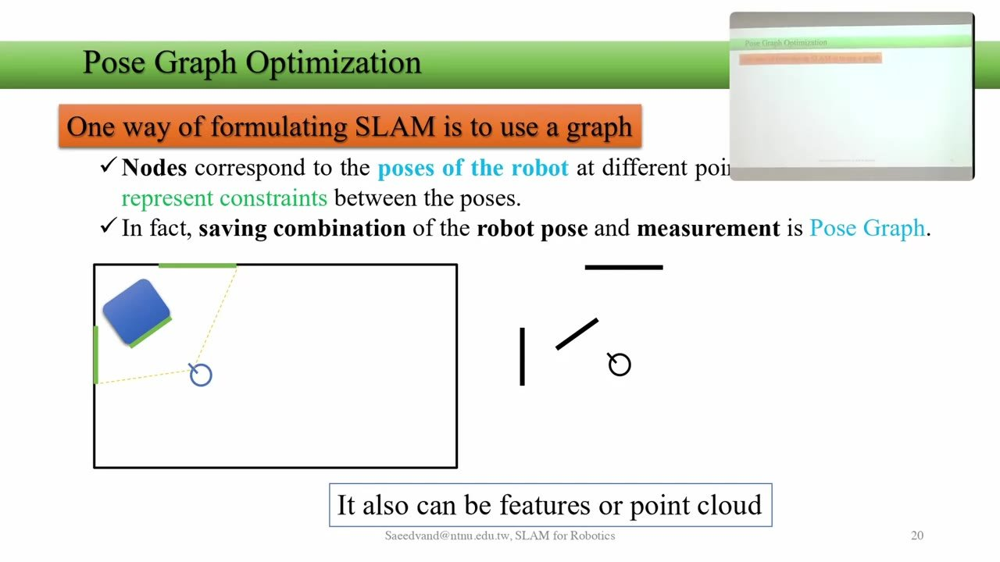

SLAM の一つの定式化がグラフ。ノードは時刻ごとのロボット姿勢。辺は姿勢どうしの拘束。姿勢と計測の組を保存したものがポーズグラフで、ノードは特徴点や点群でもよい。

## 00:11:05 二姿勢の相対距離が拘束になる

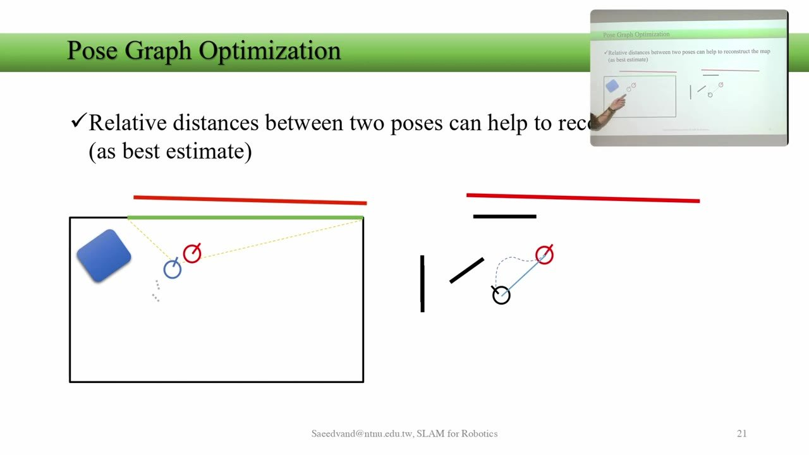

二つの姿勢のあいだの相対距離が、どちらがより確からしいかを決める材料になる。図では離れてしまった二つの観測を、相対関係で引き戻すイメージ。

## 00:11:40 拘束は回転と並進の両方

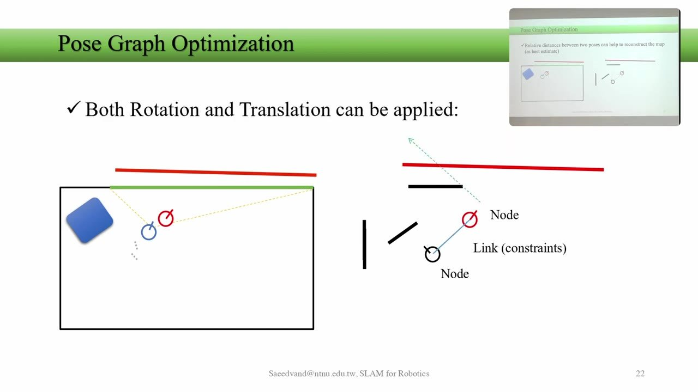

辺が運ぶのは距離だけではない。回転と並進の両方。赤い丸がノード（姿勢）、そのあいだの線がリンク（拘束）。

## 00:12:55 動きながらノードを足す

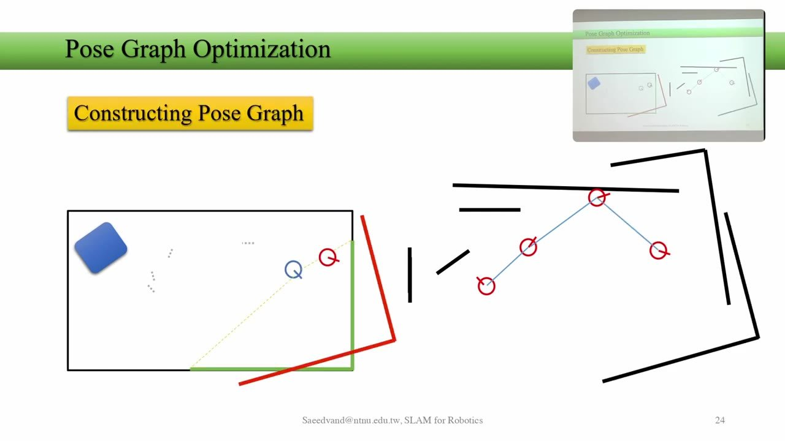

“Constructing Pose Graph”。ロボットが進むたびに姿勢ノードを追加し、連続する姿勢を辺で結ぶ。右の図は、壁の観測を伴った姿勢が鎖になっていく途中。同じアニメーションの中間フレームは省いた。

## 00:13:20 一周するとループが閉じる

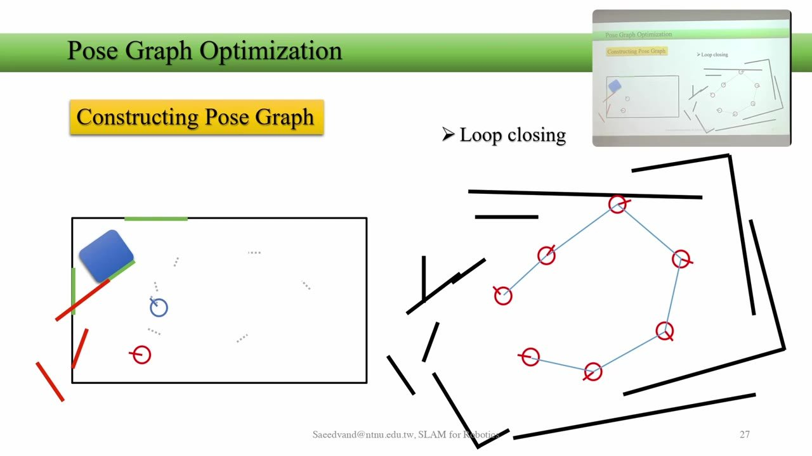

出発点の近くへ戻ると、姿勢の鎖が輪になる。この輪を認識することがループクロージング。輪ができないと、先ほどの誤差あり地図のようにドリフトが残る。

## 00:13:25 同じ特徴で輪を見つける

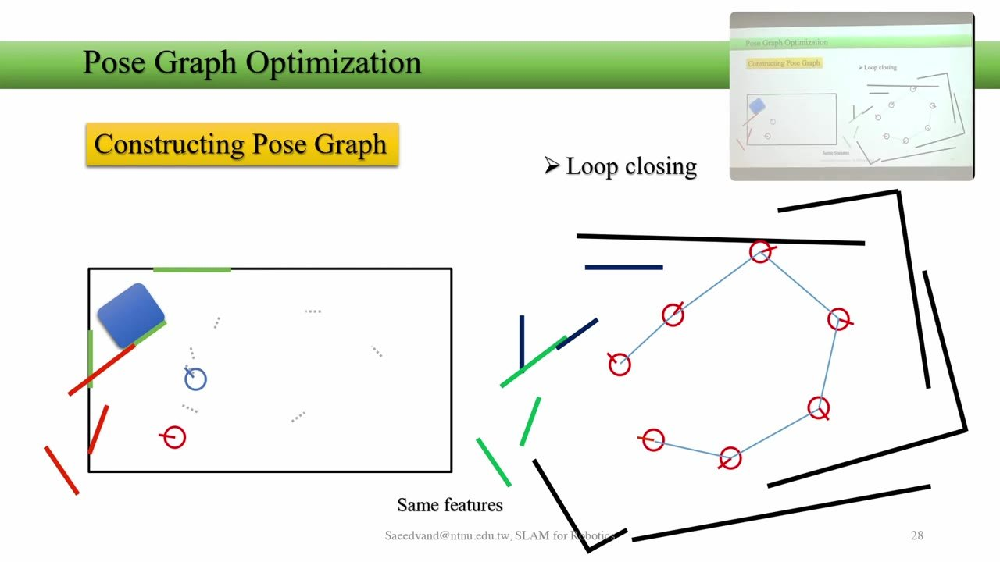

輪を閉じるには、今見ているものと昔見たものが同じだと分かる必要がある。緑と青の線分が “Same features”。別の時刻の姿勢が、同じ壁を見ている。

## 00:14:25 二つの姿勢をどう揃えるか

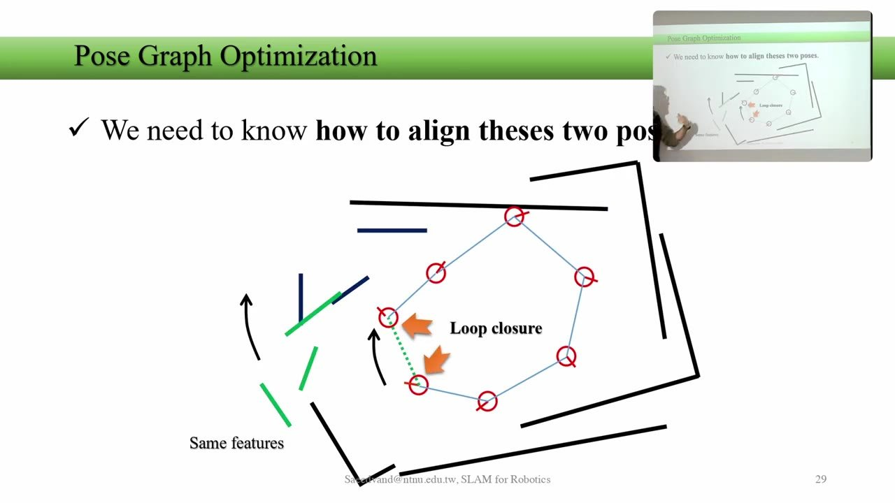

同じ特徴が見つかったら、その二つの姿勢を揃える変換を求める。矢印がループクロージャ。揃えることで、途中で積もったドリフトを輪全体へ分散できる。

## 00:15:15 ノードを鎖ごと動かす

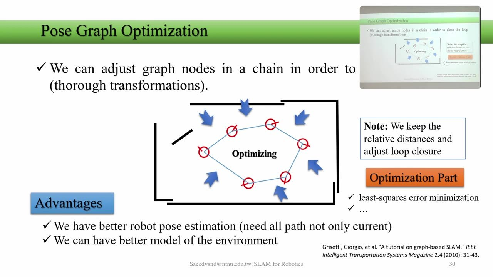

最適化では、グラフのノードを連鎖的に動かして相対距離を保ったままループを閉じる。中身は最小二乗。利点は二つ。現在位置だけでなく経路全体が良くなること、環境のモデルも良くなること。引用は Grisetti らの graph-based SLAM チュートリアル（IEEE Intelligent Transportation Systems Magazine, 2010）。

## 00:17:05 間違った対応づけは捨てる

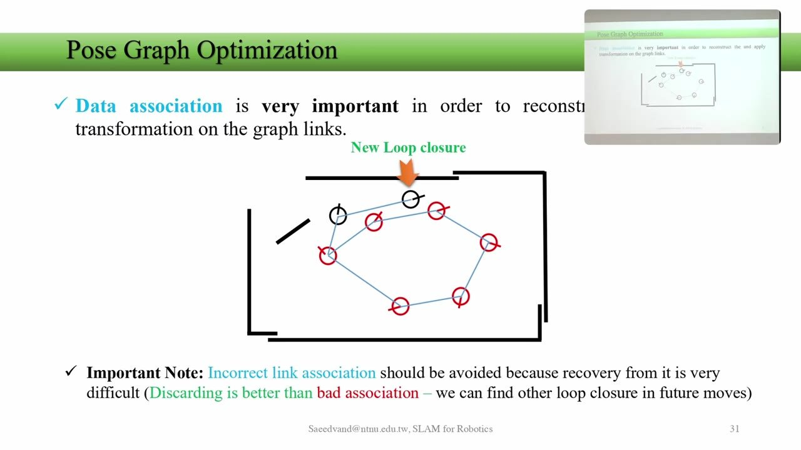

辺の変換を復元するにはデータアソシエーションが要る。ただし誤った対応は後から直しにくい。スライドの注意は、悪い対応を入れるより捨てた方がよい、というもの。次のループでまた機会がある。

## 00:19:50 最適化は最小二乗が標準

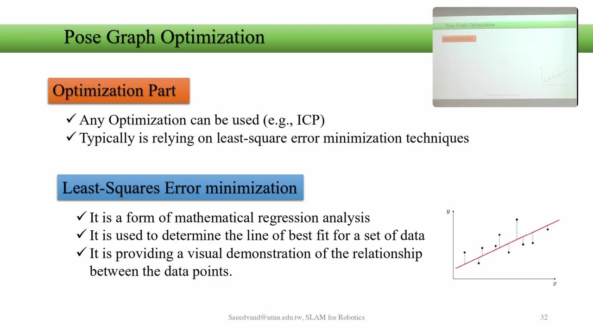

最適化そのものは ICP など何でもよいが、典型は最小二乗。点群に対する直線のあてはめと同じで、残差の二乗和を小さくする回帰。ポーズグラフでは、残差が「辺の予測」と「計測された相対姿勢」の差になる。

## 00:21:15 最適化のあと地図にする

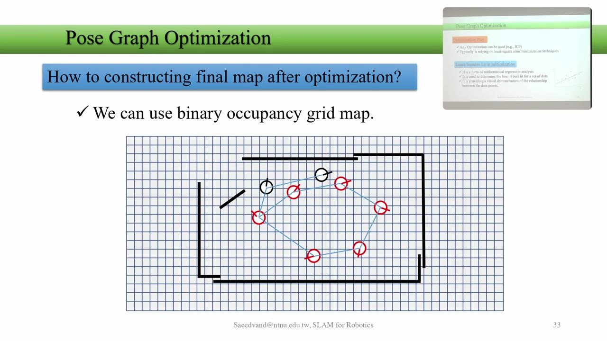

姿勢が揃ったあと、地図はどう作るか。一つの答えがバイナリ占有格子。セルを占有か空きかで塗る。図は、最適化された姿勢のまわりに壁が格子として乗っている。

## 00:22:10 格子はベイズフィルタでも更新できる

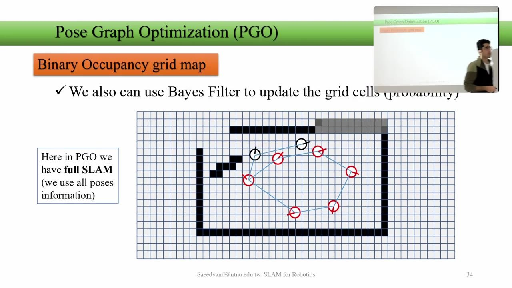

セルは 0/1 だけでなく、ベイズフィルタで占有確率を更新してもよい。吹き出しが強調するのは、ここでのポーズグラフは Full SLAM なので、現在姿勢だけでなく全部の姿勢を使う、という点。

## 00:23:50 最適化後の軌跡の例

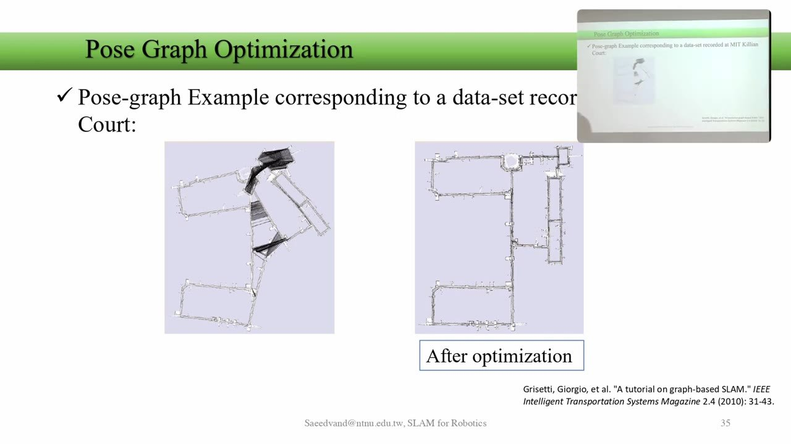

データセットで記録した軌跡を最適化した例。曲がった経路が、ループを閉じたあと矩形に近い建物外形へ揃っている。出典は同じ Grisetti らのチュートリアル。

## 00:25:05 特徴は位置と記述の二つ

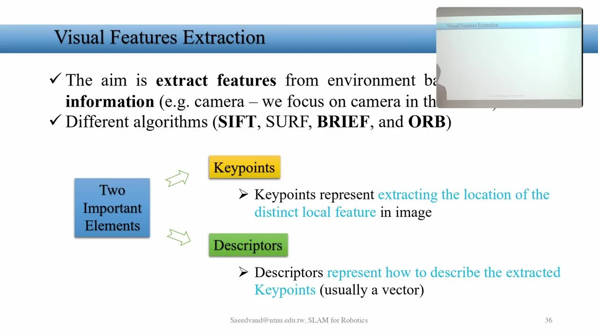

話題は視覚特徴。カメラ画像から、環境のなかで区別できる情報を取り出す。扱うアルゴリズムは SIFT、SURF、BRIEF、ORB。

部品は二つ。キーポイントは「どこが特徴か」という位置。ディスクリプタは「そこがどんな見た目か」を表すベクトル。対応づけに使うのは後者。

## 00:29:10 別の視点でも同じ点だと分かりたい

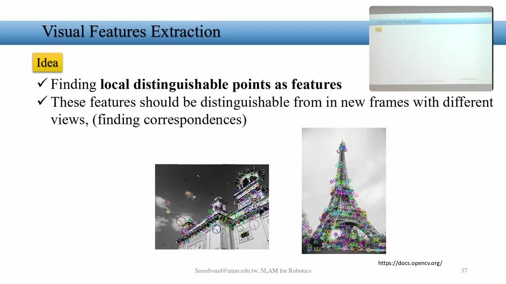

特徴に求める性質は、局所的に目立つこと、そして別フレーム・別視点でも同じ点だと分かること。エッフェル塔の写真では、色のついた点がフレームをまたいで対応している。

## 00:30:55 SIFT は回転とスケールに不変

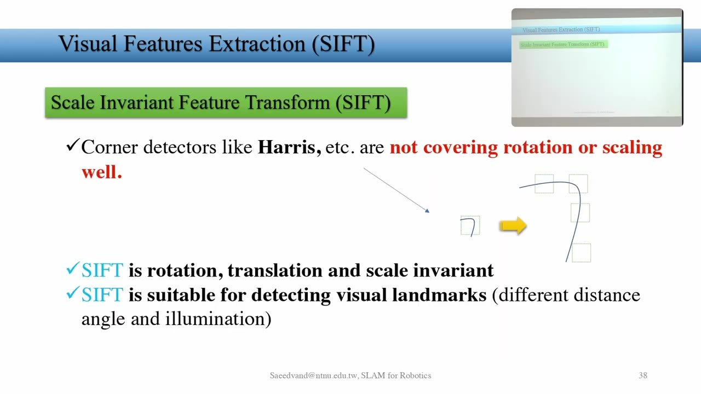

Harris のようなコーナー検出は、回転や拡大縮小に弱い。SIFT（Scale Invariant Feature Transform）は回転・並進・スケールに不変で、距離や明るさ、見る角度が変わってもランドマークを拾いやすい。

## 00:33:05 SIFT は検出してから記述する

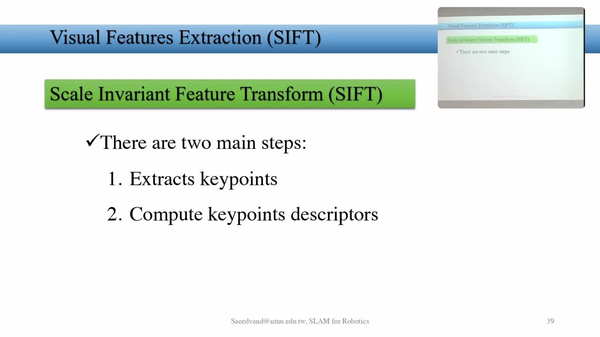

SIFT の手順は二つ。キーポイントを抽出する。そのキーポイントのディスクリプタを計算する。

## 00:33:25 コーナーは明るさの勾配

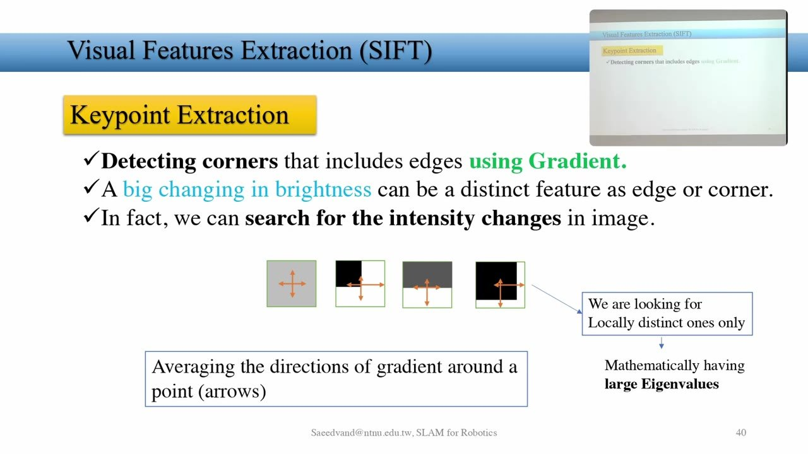

キーポイントは勾配で探す。明るさが大きく変わる場所がエッジやコーナーになる。ある点のまわりの勾配方向を平均し、局所的に際立つ点、つまり固有値が大きい点を残す。

## 00:37:15 スケール空間はガウシアンの差

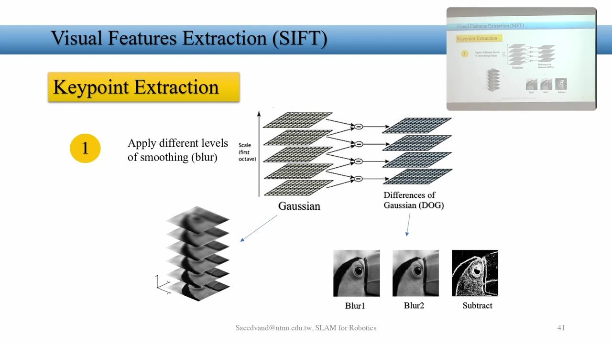

スケール不変にするため、ぼかしの強さを変えた画像の塔を作る。隣り合うぼかしの差が Difference of Gaussian（DoG）。コーナーはこの差分画像のなかで探す。

## 00:38:40 違う大きさで撮った同じ景色

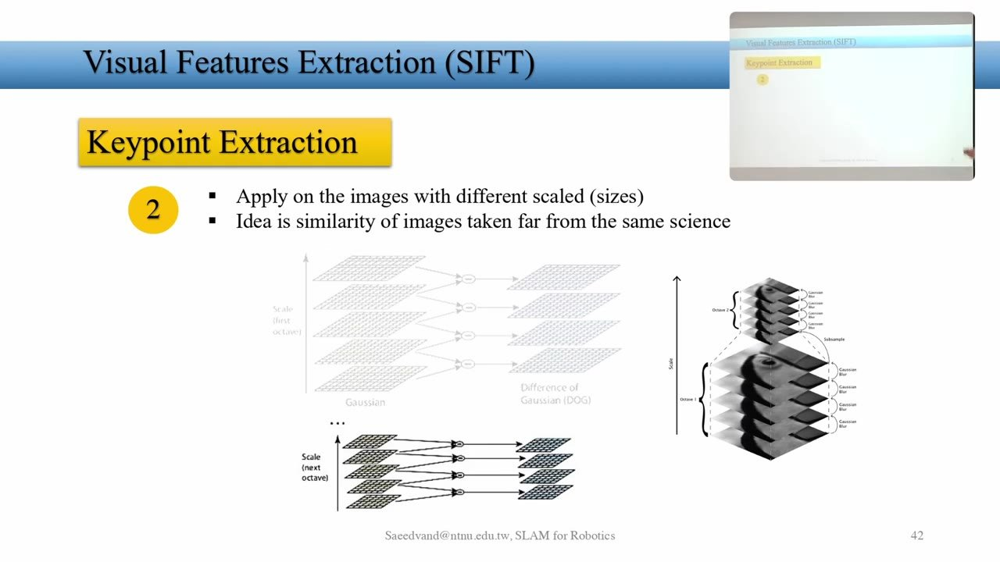

同じ処理を、解像度の違う画像にもかける。遠くから撮った写真と近くから撮った写真を、同じ特徴として対応させるため。

## 00:40:20 一番強いスケールを選ぶ

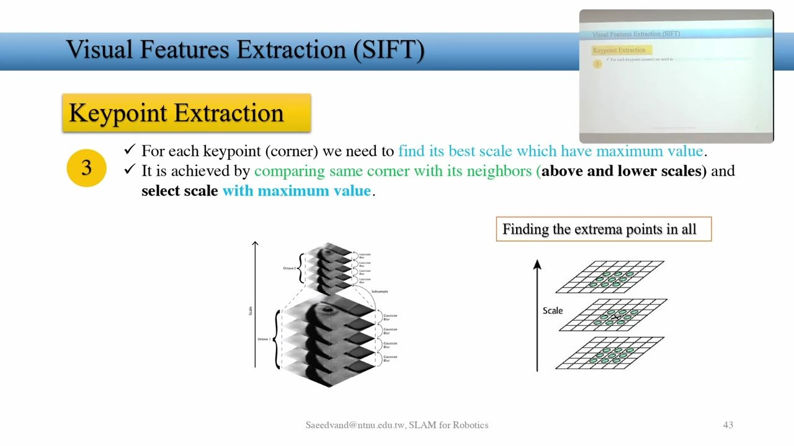

各コーナーについて、上下のスケールと比べて値が最大になるスケールを採用する。その点が「この大きさで最もはっきり見える」ということ。DoG の全部のスケールから極値を拾う。

## 00:41:40 対応づけには記述が要る

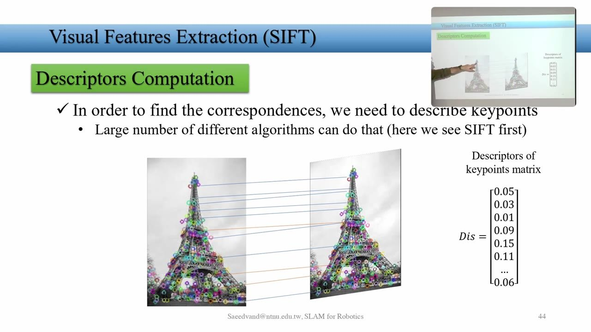

位置だけでは、左右の写真のどの点と同じか分からない。各キーポイントをベクトルで記述し、ベクトルどうしの距離で対応を決める。図の行列 `Dis` がその距離。

## 00:43:20 SIFT 特徴の中身

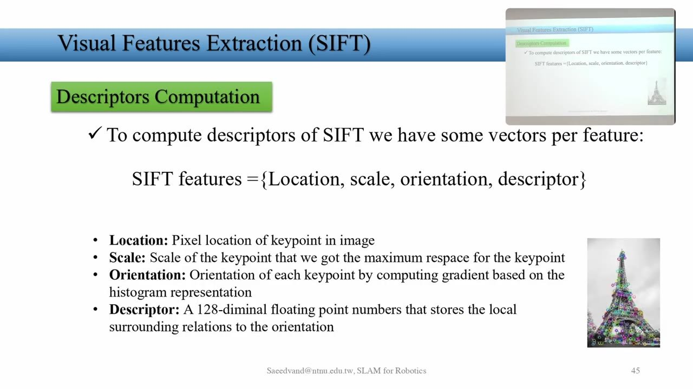

SIFT の一つの特徴は四つ組。位置（画素）、スケール（その点が最も応答したぼかし）、向き（周囲の勾配から決める主方向）、ディスクリプタ（向きを基準にした周囲の勾配を入れた 128 次元の実数ベクトル）。

## 00:45:50 128 次元は 4×4×8

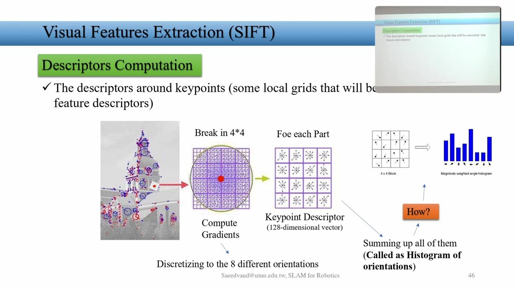

ディスクリプタの作り方。キーポイント周辺を 4×4 の小領域に分け、各領域で勾配を 8 方向のヒストグラムに投票する。4×4×8 で 128 次元。主方向に揃えてから数えるので、画像が回転しても同じベクトルに近くなる。

## 00:49:40 距離で対応を決める

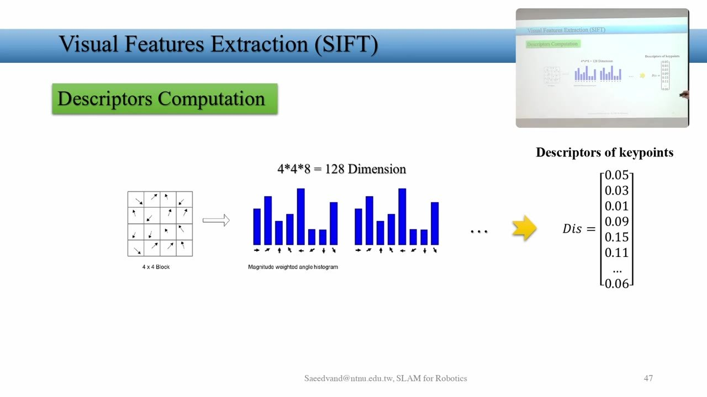

128 個の向きヒストグラムが、その点のディスクリプタになる。

## 00:50:05 良い対応だけ残す。ただし SIFT は重い

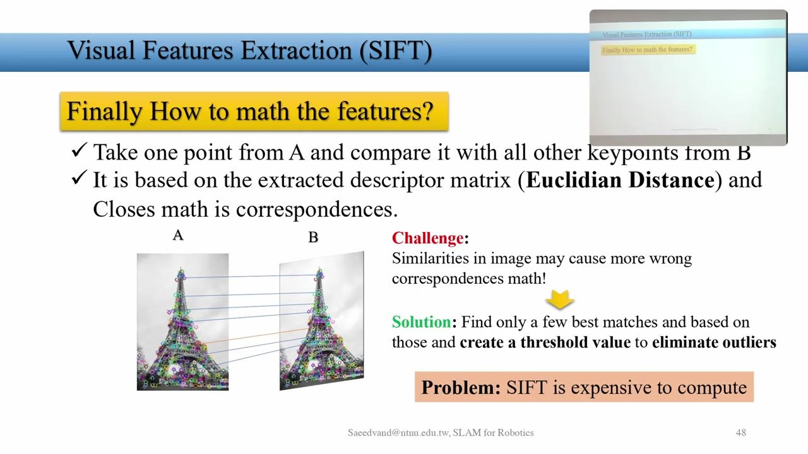

画像 A の点と画像 B の全キーポイントを、ディスクリプタのユークリッド距離で比べ、一番近いものを対応候補にする。見た目が似た場所が多いと誤対応が増えるので、上位だけを残し、閾値で外れ値を落とす。スライドが最後に強調するのは、SIFT は計算が重い、ということ。これが BRIEF と ORB に進む理由。

## 00:55:10 明るさの比較でビット列を作る

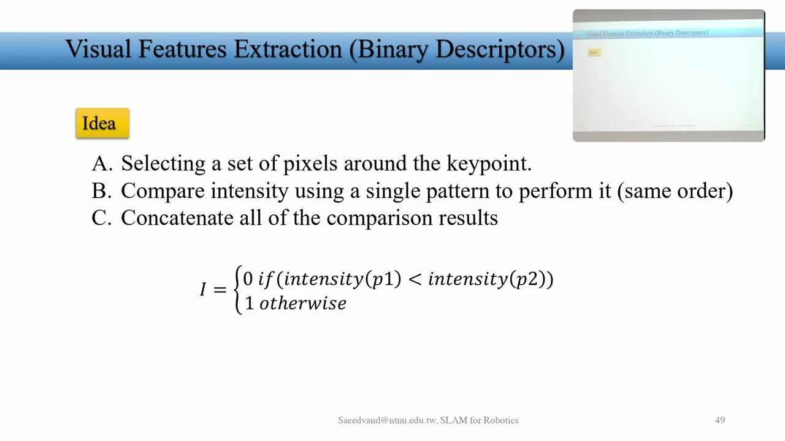

バイナリディスクリプタの考え方。キーポイントのまわりで画素の組を決める。各組で明るさを比べ、暗ければ 0、明るければ 1。そのビットを連結する。実数の 128 次元より比較が軽い。

## 00:56:35 例と、ビット列である利点

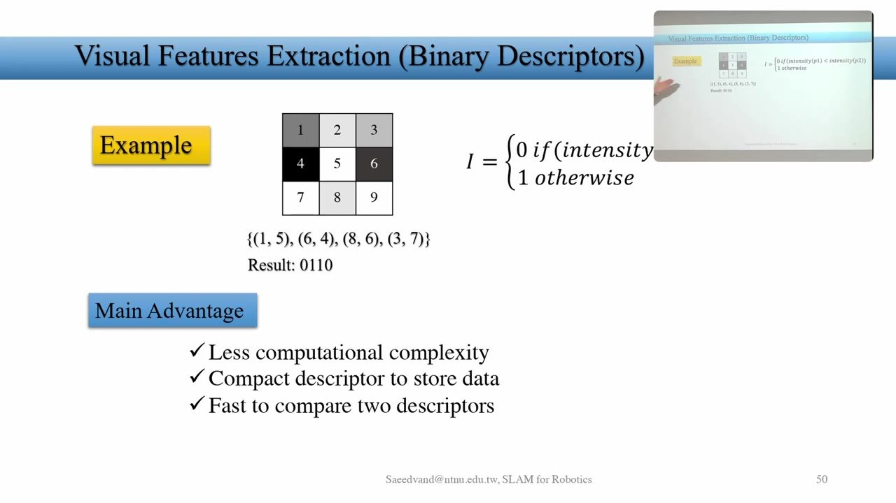

3×3 の例。比較する組が `(1,5), (6,4), (8,6), (3,7)` で、結果のビット列は `0110`。利点は計算量が少ないこと、表現が短いこと、二つのディスクリプタの比較が速いこと。

## 01:00:25 BRIEF は回転に弱い

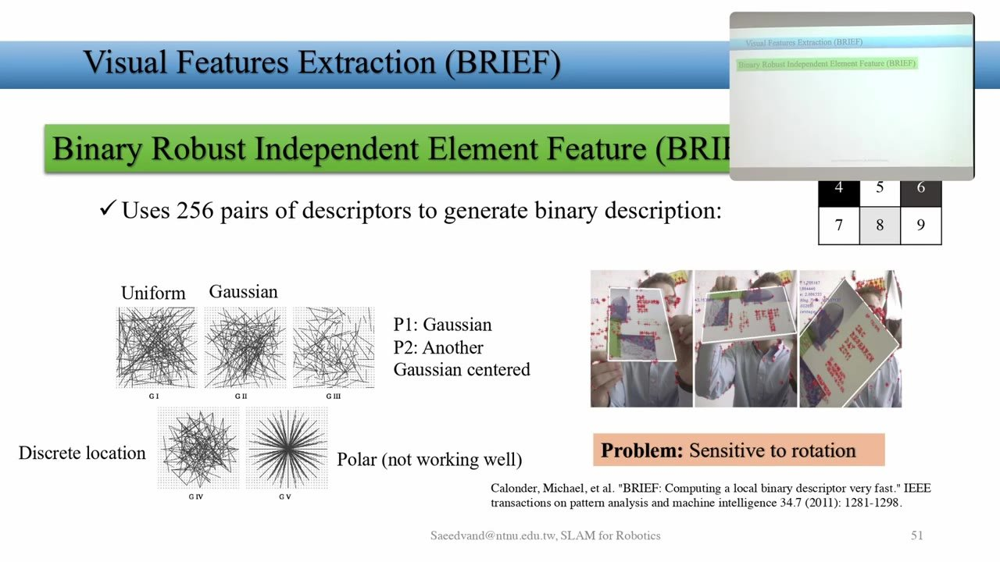

BRIEF（Binary Robust Independent Elementary Feature）は、256 組の比較でバイナリ記述を作る。点の取り方は一様分布よりガウシアンがよい。極座標の取り方はうまくいかない、と図にある。根本的な弱点は回転に敏感なこと。画像が回ると、同じ組が別の画素を比べてしまう。出典は Calonder らの BRIEF 論文（TPAMI, 2011）。

## 01:03:35 ORB は BRIEF に向きを足す

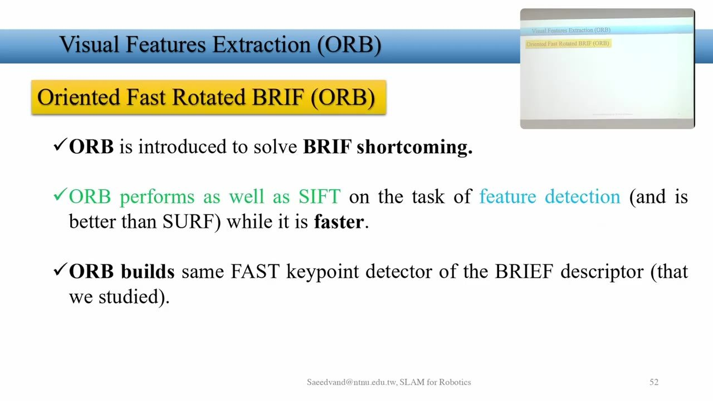

ORB は Oriented FAST and Rotated BRIEF。BRIEF の回転弱点を埋めるために導入された。特徴検出の性能は SIFT に並び、SURF より良く、しかも速い、とスライドは述べる。検出器は FAST、記述子は向きを考慮した BRIEF。

## 01:05:20 向きは重心で決める

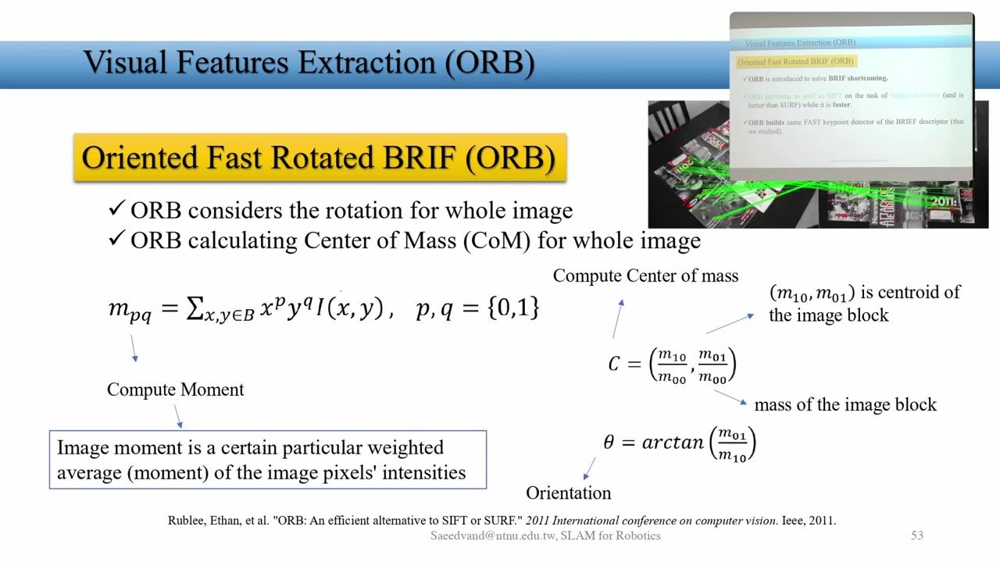

ORB はパッチの回転を、画像モーメントから求める。パッチの重心 `C` を計算し、中心から重心への角度 `θ = arctan(m01 / m10)` をその特徴の向きにする。出典は Rublee らの ORB 論文（ICCV, 2011）。

## 01:08:00 向きに合わせて比較組を回す

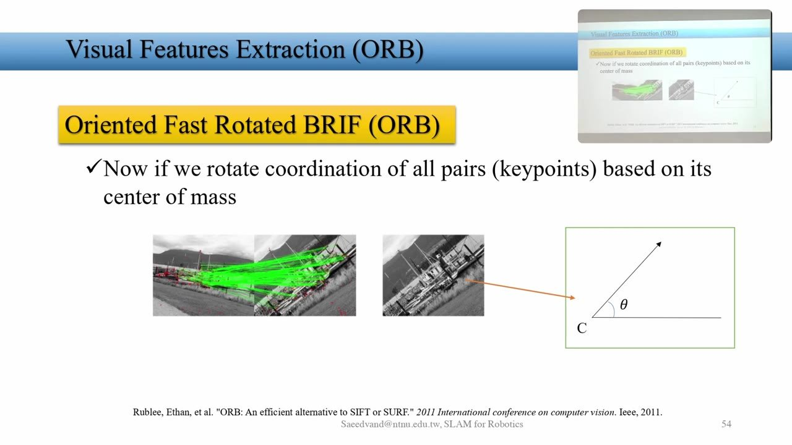

各キーポイントの比較組を、その重心方向 `θ` だけ回転させてから BRIEF を計算する。こうすると画像が回っても同じビット列に近くなる。図はパッチが回転し、記述の座標系も一緒に回る様子。

## 01:09:25 OpenCV での抽出

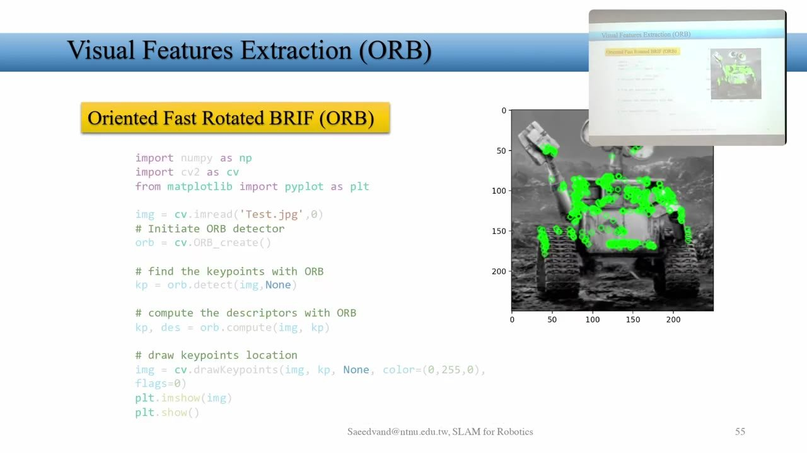

OpenCV の例。`cv.ORB_create()` で検出器を作り、`detect` でキーポイント、`compute` でディスクリプタを得る。右の写真は、抽出した点を緑で描いたもの。

## 01:10:00 SIFT / SURF / ORB の比較

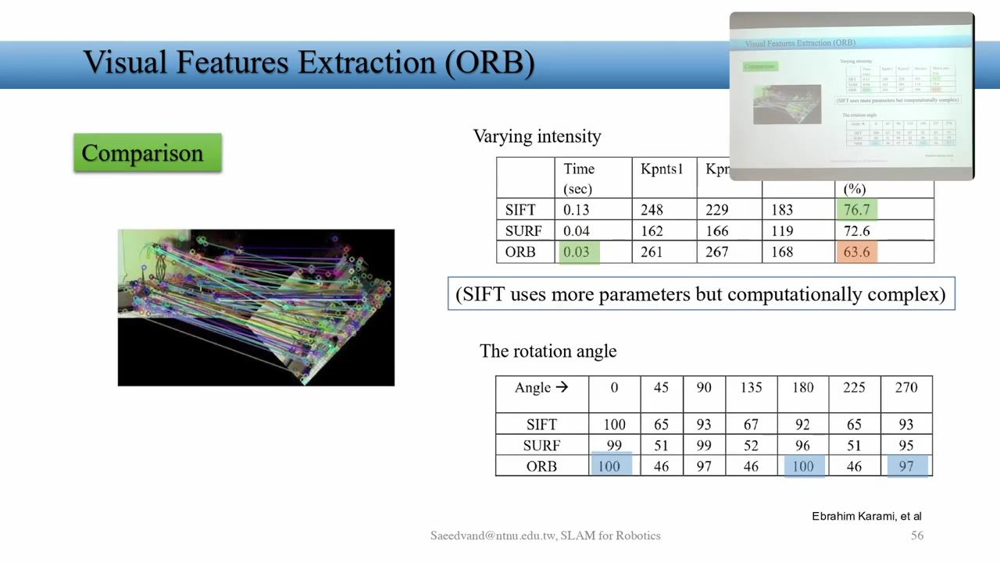

照度を変えた実験の処理時間は、SIFT 0.13 秒、SURF 0.04 秒、ORB 0.03 秒。マッチ率の列は SIFT 76.7%、SURF 72.6%、ORB 63.6% で、ORB は最も速いが率は一番低い。注釈は「SIFT はパラメータが多いが計算が重い」。

回転角の表では、ORB は 0 度と 180 度で 100 を保つ一方、45 度、135 度、225 度では 46 まで落ちる。向き補正しても、45 度刻みのすべてに同じ強さではない。出典は Ebrahim Karami ら。講義ではこのあと一度前のスライドに戻るが、内容は同じなので省いた。

## 01:19:30 Bundle Adjustment は再投影誤差を小さくする

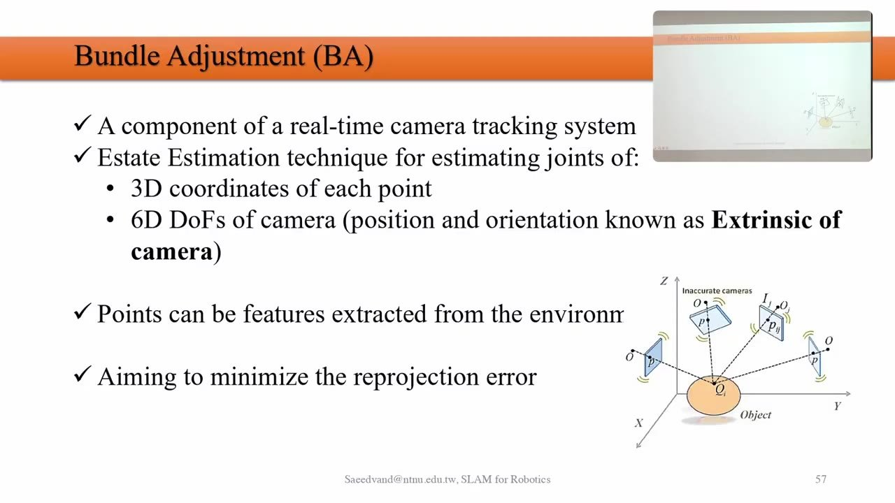

Bundle Adjustment（BA）はリアルタイム追跡の一要素で、次を同時に推定する。各点の 3 次元座標。カメラの 6 自由度（位置と姿勢、外部パラメータ）。点は画像から抽出した特徴でよい。狙いは再投影誤差を最小化すること。図は、複数カメラから一つの物体点へ光線が集まる様子。

## 01:22:45 特徴ベース復元の最後段

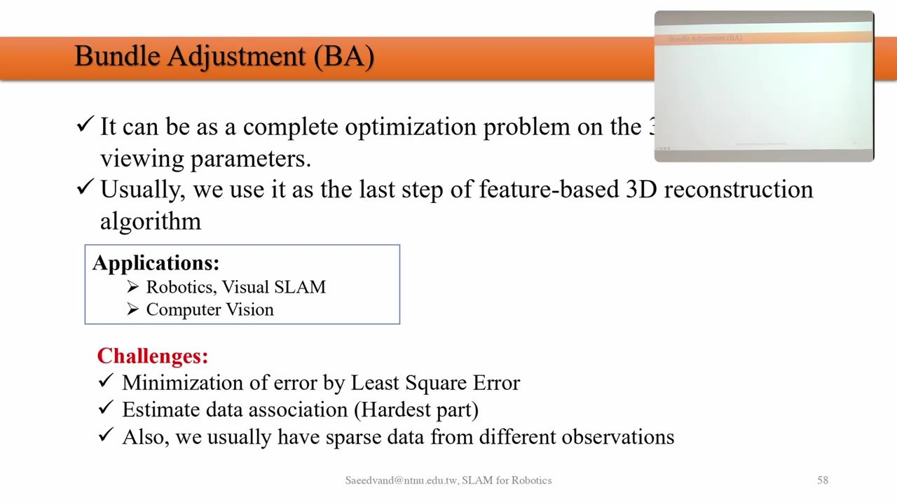

BA は、見ているカメラパラメータ全体の最適化としても書ける。特徴ベースの 3 次元復元では、通常は最後の段階で使う。用途はロボティクス、Visual SLAM、コンピュータビジョン。難しいのは、最小二乗そのものより、どの点が同じ点かというデータアソシエーションと、観測が疎なこと。

## 01:25:15 ノイズがあると等式は厳密には成り立たない

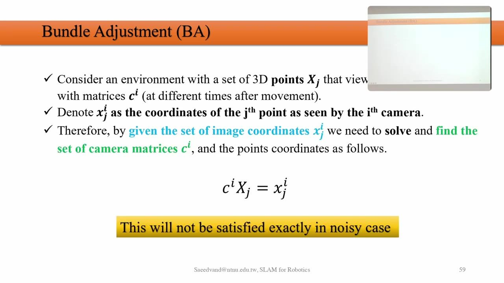

3 次元点 `Xj` を、時刻 `i` のカメラ行列 `c^i` で写すと画像座標 `x^i_j` になる、という関係。計測にノイズがなければ `c^i Xj = x^i_j` だが、スライドは “This will not be satisfied exactly in noisy case” と断っている。だから誤差を最小化する問題になる。

## 01:27:25 ガウスノイズなら最小二乗が最尤

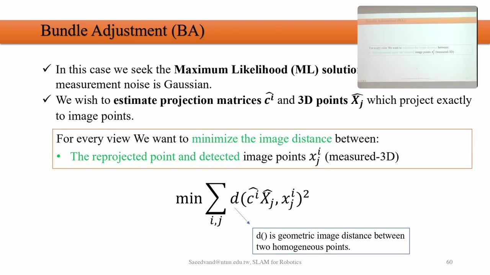

計測ノイズがガウスなら、最尤解は再投影誤差の二乗和の最小化になる。推定するのはカメラの投影行列と 3 次元点。各視点で、投影した点と実際に検出した点の画像上の距離 `d` を足す。

## 01:28:45 光線の束をまとめて調整する

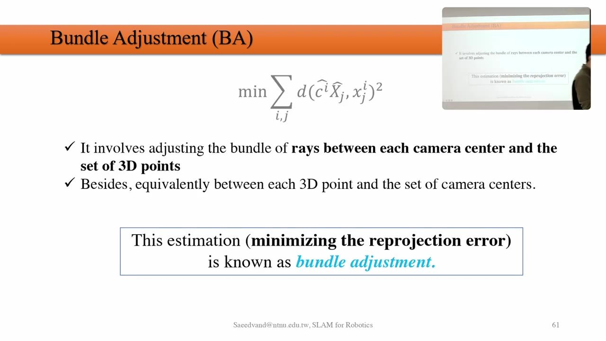

この最小化は、各カメラ中心と 3 次元点を結ぶ光線の束を、両側から調整していることに相当する。再投影誤差を最小化するこの推定が Bundle Adjustment。

## 01:31:00 見えている点をつなぐグラフ

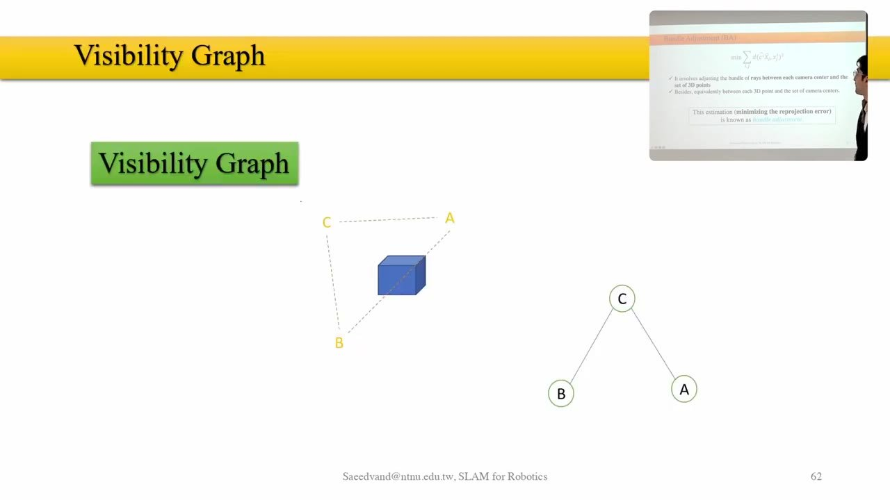

Visibility Graph。カメラ（またはロボット）から、そのとき見えているランドマークへ辺を張る。図では一つの姿勢 C から A と B が見えていて、グラフは C を根に A と B がぶら下がる。

## 01:32:40 ランドマークどうしの共視

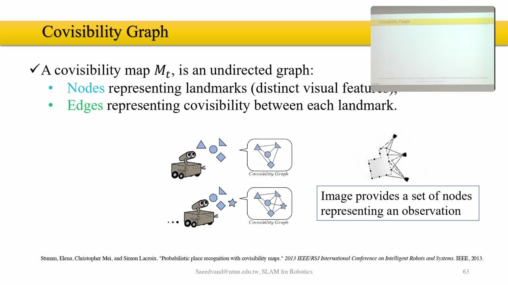

Covisibility map は無向グラフ。ノードはランドマーク（別々の視覚特徴）。辺は、それらが同じ観測のなかで一緒に見えたこと。一枚の画像が、ノードの集合を一つの観測として与える。出典は Stumm、Mei、Siegwart の共視地図の論文（IROS, 2013）。

## 01:36:00 観測のたびに共視を更新する

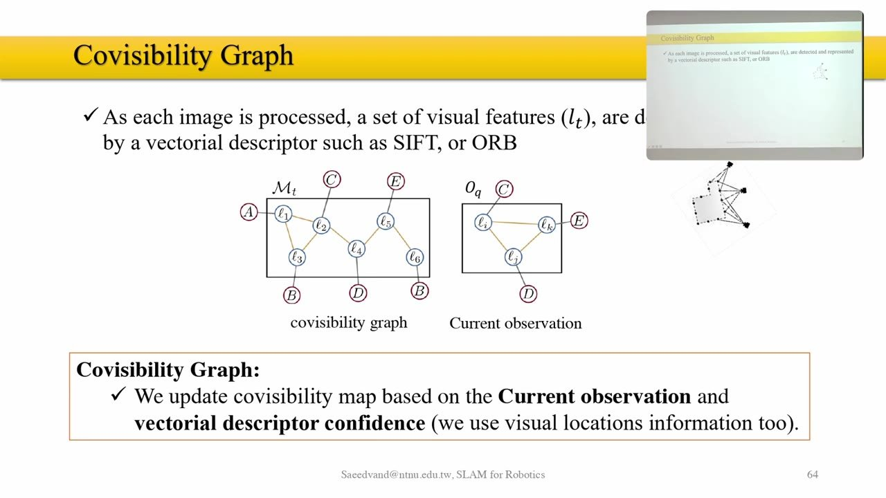

画像を処理するたびに特徴 `lt` を SIFT や ORB のベクトルで記述する。その観測で一緒に見えたランドマークのあいだに辺を足し、ディスクリプタの確信度も更新する。位置の情報も使う。右の小さい図が、現在の観測を既存の共視グラフへマージするイメージ。

## 01:37:50 ORB-SLAM が BA に渡す条件

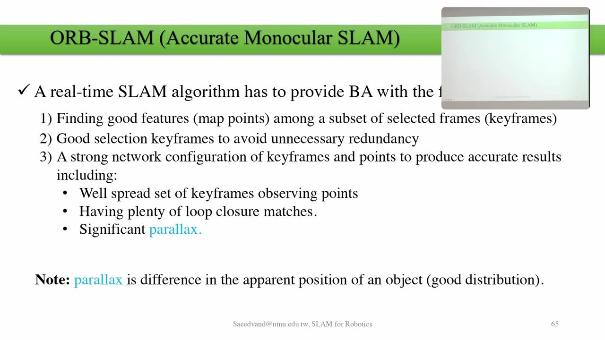

リアルタイム SLAM が BA を成立させるための条件が並ぶ。

1. 選んだキーフレームのなかから、地図点になる良い特徴を見つける
2. 冗長なキーフレームを入れない
3. キーフレームと点のネットワークを強くする。点が多くのキーフレームから見えること、ループを閉じる対応が十分あること、視差（見え方の位置の差）が大きいこと

視差の注釈は、物体の見かけの位置の差で、分布が良いほど幾何が安定する、という意味。

## 01:42:40 スケールするための地図

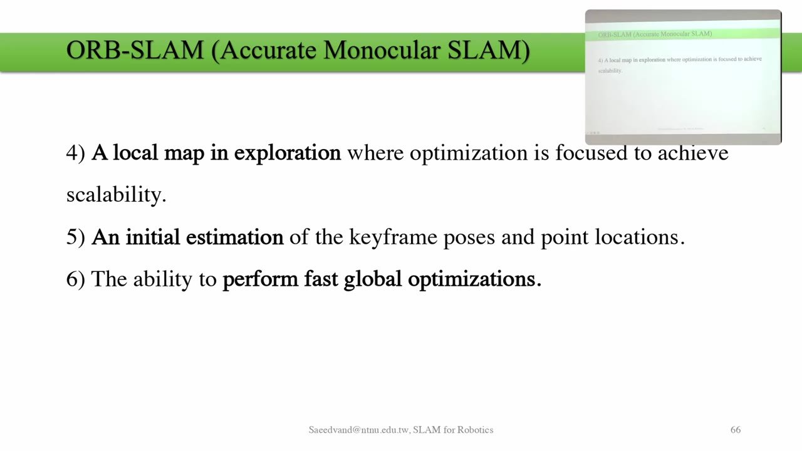

続き。

4. 探索中の局所地図は、全体を毎回最適化しないことでスケールする
5. キーフレーム姿勢と点位置の初期値が要る
6. 全体最適化を速く回せる必要がある

## 01:43:50 ORB-SLAM の守備範囲

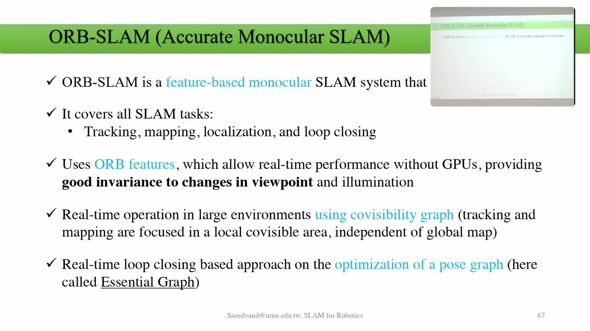

ORB-SLAM は特徴ベースの単眼 SLAM で、追跡、地図作成、自己位置推定、ループクロージングを全部やる。特徴は ORB なので GPU なしで実時間になり、視点と照明の変化に比較的強い。広い環境では共視グラフを使い、追跡と地図作成は今見えている局所領域に限定する。ループはポーズグラフ（ここでは Essential Graph）の最適化で閉じる。

## 01:46:15 三つのスレッド

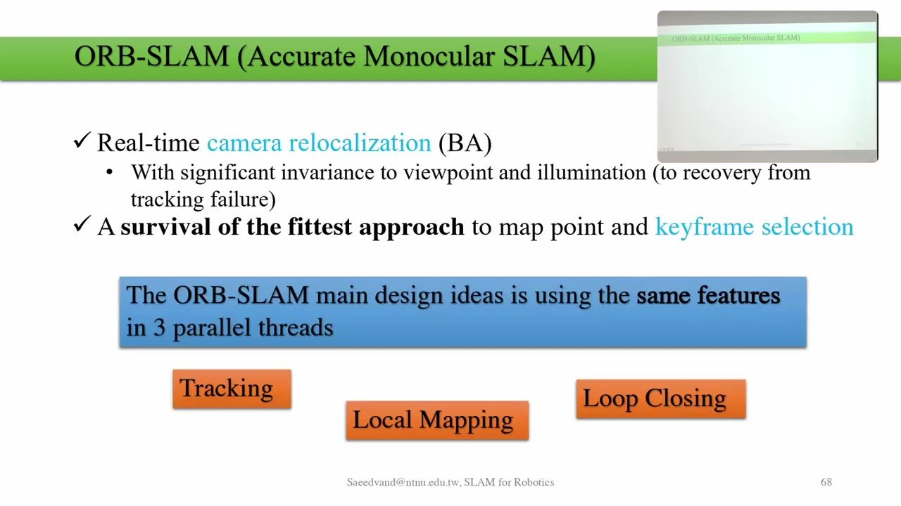

再ローカライズは実時間の BA で、視点や照明が変わっても追跡失敗から復帰しやすい、とスライドは言う。地図点とキーフレームは、適応度の高いものを残す選択をする。設計の中心は、同じ特徴を三つの並列スレッドで使うこと。Tracking、Local Mapping、Loop Closing。

## 01:47:55 システムのブロック図

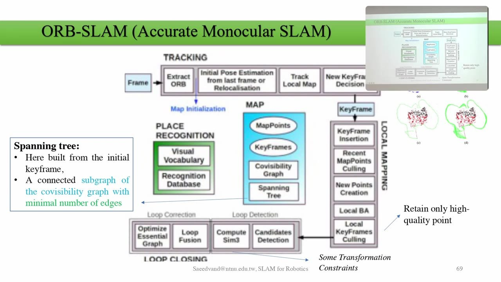

左の Tracking は ORB を抽出し、前フレームか再ローカライズから姿勢の初期値を作り、局所地図で追跡し、新しいキーフレームを切る。

中央の Local Mapping はキーフレームを挿入し、最近追加した点を間引き、局所 BA をかけ、冗長なキーフレームを捨てる。

右の Loop Closing は候補を検出し、相似変換を計算し、ループを融合し、Essential Graph を最適化する。

スパニングツリーは最初のキーフレームから伸びる共視グラフの部分木で、辺の数が最小の連結グラフ。地図点は質の高いものだけ残す。

## 01:52:45 共視グラフと Bag of Words

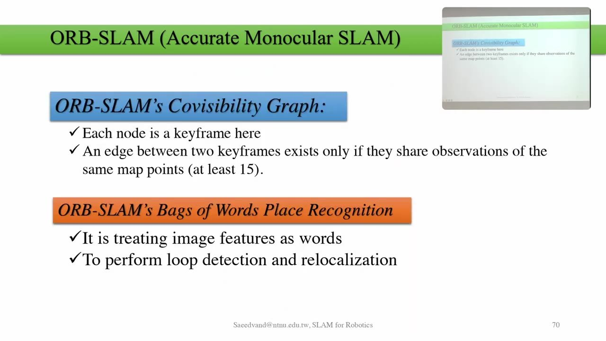

ORB-SLAM の共視グラフでは、ノードがキーフレーム。二つのキーフレームが同じ地図点を少なくとも 15 個共有するときだけ辺を張る。

場所認識は Bag of Words。画像特徴を単語とみなし、ループ検出と再ローカライズに使う。

## 01:54:30 単語はオフラインで作る

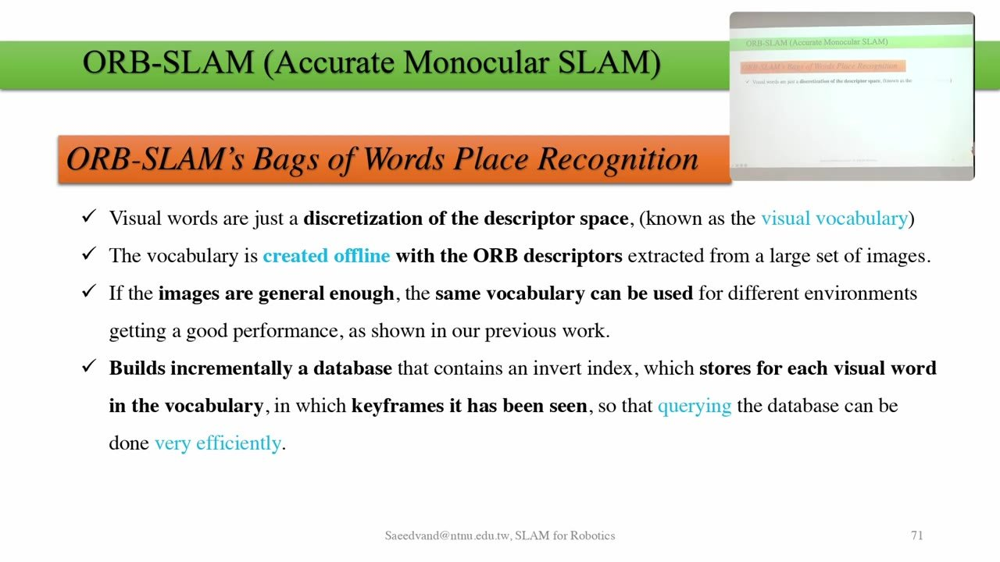

ビジュアルワードはディスクリプタ空間を離散化したもの。語彙は大量の画像から ORB ディスクリプタを集め、オフラインで作る。環境が違っても同じ語彙を使える、とスライドは言う。データベースは転置インデックスで、各単語がどのキーフレームで見えたかを持つ。クエリはこの索引を引くので速い。

## 01:55:45 三つの版

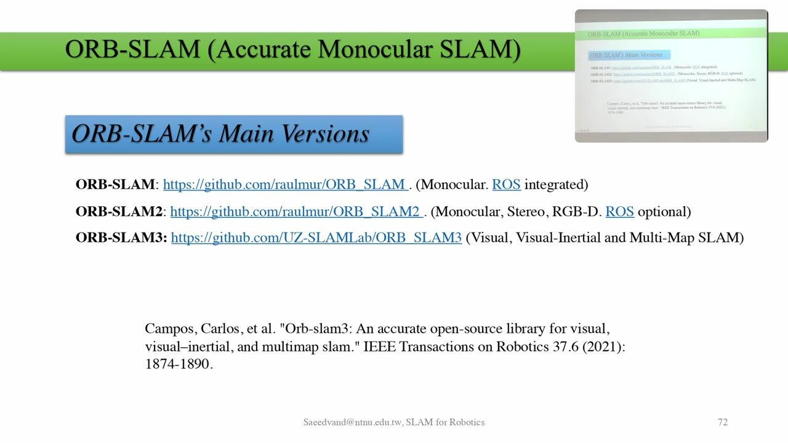

- ORB-SLAM: 単眼。ROS に統合。リポジトリは [raulmur/ORB_SLAM](https://github.com/raulmur/ORB_SLAM)
- ORB-SLAM2: 単眼、ステレオ、RGB-D。ROS は任意。[raulmur/ORB_SLAM2](https://github.com/raulmur/ORB_SLAM2)
- ORB-SLAM3: 視覚、視覚慣性、複数地図。[UZ-SLAMLab/ORB_SLAM3](https://github.com/UZ-SLAMLab/ORB_SLAM3)

引用は Campos らの ORB-SLAM3 論文（IEEE Transactions on Robotics, 2021）。

## 01:58:00 デモの条件

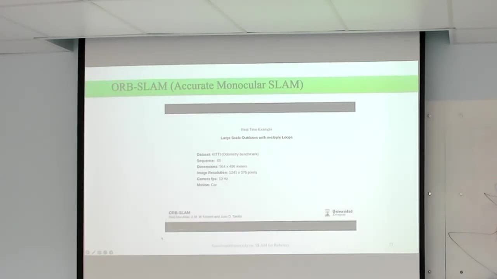

ここから教室のプロジェクタを映した映像。ORB-SLAM の公開デモで、データは KITTI のオドメトリ、シーケンス 00、車載カメラ。解像度とフレームレートがスライドに書かれている。大きい屋外環境で、ループが複数回閉じる例。

## 01:58:20 単眼で道と地図を同時に出す

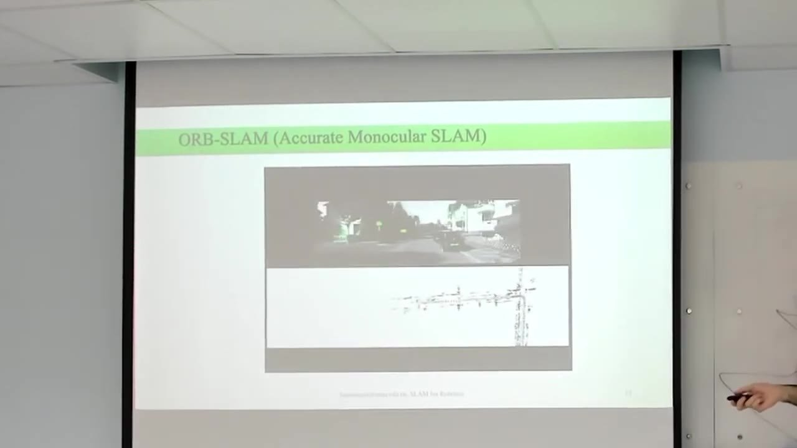

走行中の映像と、その下に構築中の特徴点地図。車が直進するあいだ、地図が進行方向へ伸びる。同じデモの続きは趣旨が同じなので、この一枚にまとめた。

## 02:00:00 ORB-SLAM2 の論文紹介

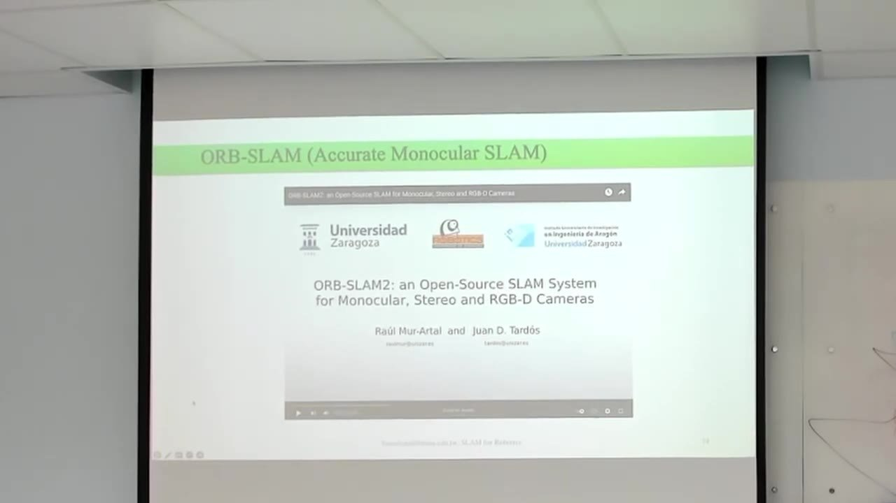

続く動画のタイトル。Mur-Artal と Tardós の “ORB-SLAM2: an Open-Source SLAM System for Monocular, Stereo and RGB-D Cameras”（Universidad de Zaragoza）。

## 02:00:25 速度を上げた追跡

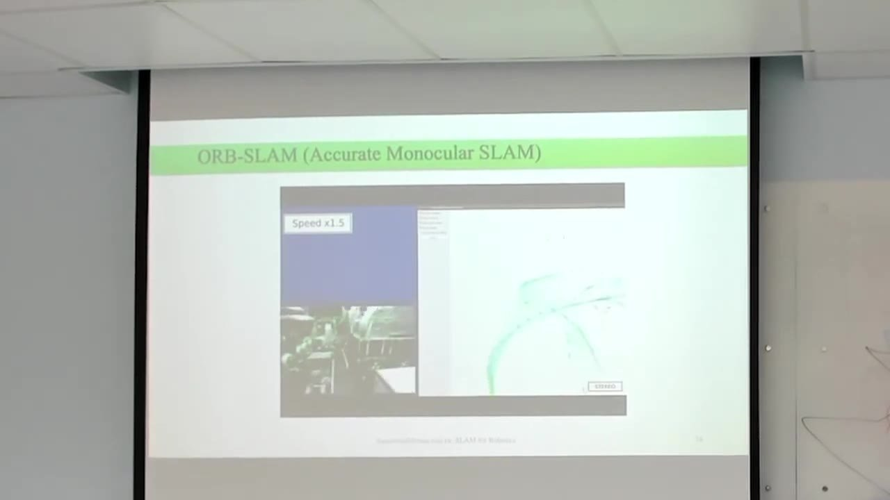

ORB-SLAM2 のデモ。左がカメラ、右が推定軌跡で、表示は 1.5 倍速。室内を動きながら緑の軌跡が伸びる。人が写り込むフレームや、映像が切り替わるだけのフレームは省いた。

## 02:01:20 ループを含む軌跡

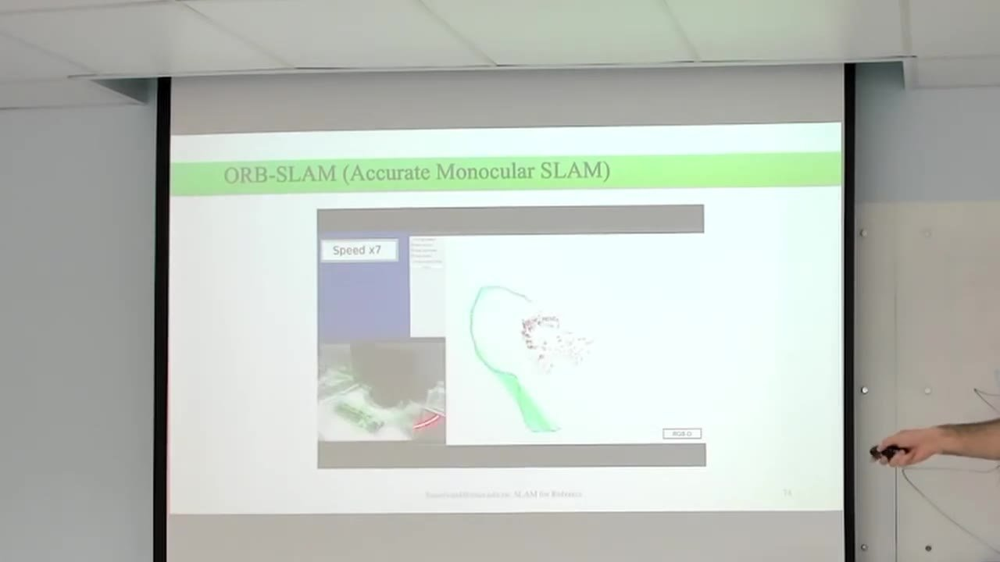

別クリップを 7 倍速で再生している画面。右の地図に、閉じた緑のループと特徴点の塊が見える。単眼でも、ループを検出すると軌跡が輪として整合する、という演示。

## 02:02:35 他手法との機能比較

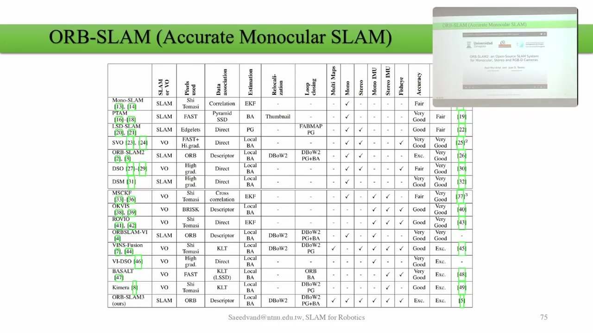

単眼 SLAM / Visual Odometry の比較表。列は、特徴か直接法か、データアソシエーション、推定（EKF か BA か）、再ローカライズ、ループクロージング、対応センサ、精度。

ORB-SLAM の行は、ORB、ディスクリプタによる対応、局所 BA、再ローカライズとループに DBoW2、単眼のみ、精度は Exc. / Very Good。ORB-SLAM2 はステレオと RGB-D が増える。最終行の ORB-SLAM3 は複数地図、IMU、魚眼までチェックが入り、精度も Exc. / Exc.。PTAM、LSD-SLAM、DSO、VINS-Fusion などが同じ表に並ぶ。

## 02:07:15 キャンパスでの ORB-SLAM3

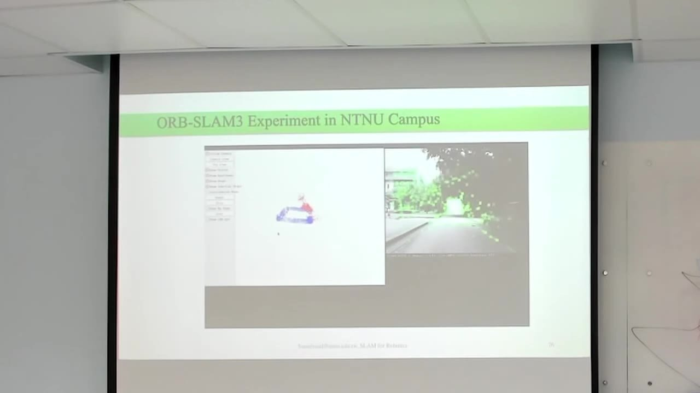

“ORB-SLAM3 Experiment in NTNU Campus”。左が点群とカメラ軌跡、右がキャンパスの道の映像。車載ではなく、学内を歩いた、または走ったシーケンスの演示。同じ実験の別瞬間は省いた。

## 02:07:30 まとめ

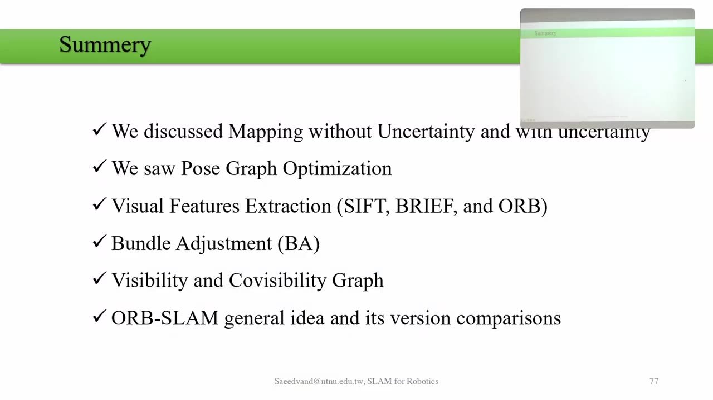

スライド見出しは “Summery”。この章で扱ったものは次のとおり。

- 誤差がない地図と、誤差がある地図
- Pose Graph Optimization
- 視覚特徴の抽出（SIFT、BRIEF、ORB）
- Bundle Adjustment
- Visibility Graph と Covisibility Graph
- ORB-SLAM の考え方と、版による違い

## QA

### ORB-SLAM / ORB-SLAM3 は出力として何を出す？

出すのはカメラ姿勢の時系列と、疎な3次元点の地図である。密な点群、メッシュ、占有格子は出さない。

姿勢は各フレームとキーフレームの回転と並進である。単眼だけだと大きさは不定で、ステレオ、RGB-D、IMU ありだとメートル単位になる。地図の点は画像から追跡した特徴点で、各点に ORB の記述子が付く。

版による違いは次のとおり。

- ORB-SLAM は単眼で、地図は一つである。大きさは不定である。
- ORB-SLAM2 は単眼に加えてステレオと RGB-D に対応し、これらは実寸の軌跡を出す。地図は一つである。
- ORB-SLAM3 は複数の地図（Atlas）を持てる。視覚慣性モードでは姿勢に加えて速度と IMU のバイアスも推定する。地図の保存と読み込みができ、読み込み後は位置合わせだけを走らせる使い方もできる。

実行後に残るファイルは、主に全フレームの軌跡（`CameraTrajectory.txt`）とキーフレームだけの軌跡（`KeyFrameTrajectory.txt`）である。中身はタイムスタンプと位置・姿勢で、データセットに応じて TUM 形式、KITTI 形式、EuRoC 形式になる。ループを閉じたあとの軌跡は、閉じる前のオンライン推定とは別に保存される。

### なぜ疎な3次元点群になるのか。ORB では多くの特徴点が取れるのでは？

ORB で多く取れる点も、画像の画素に比べればごく一部である。そのうち地図に残るのは、複数の視点から同じ点だと確認できたコーナーだけなので、結果は疎な点群になる。

1枚の画像は数十万画素ある。ORB-SLAM が1フレームから使う特徴は、設定にもよるがおおよそ1000〜2000点である。FAST 系の検出器は、明るさが急に変わるコーナーだけを拾う。壁や空や路面のような一様な面には点が出ない。

検出した点が、そのまま地図の点になるわけでもない。

- 今のフレームを既存の地図へ合わせるためだけに使い、新しい点としては残さないものがある
- 別のキーフレームでも同じ点だと対応が取れ、視差が十分あるものだけを三角測量して3次元点にする
- 観測回数が少ない点、再投影誤差が大きい点、対応が安定しない点は Local Mapping が捨てる
- 近いキーフレームからは同じ地図点が見えるので、検出のたびに新しい点は増えない

残るのは、何度見ても同じ場所だと分かるランドマークである。ループ検出や局所的な Bundle Adjustment を実時間で回すための点であり、面を埋めるための点ではない。面まで欲しい場合は、勾配のある画素を広く使う半密な手法や、深度を面として融合する密な手法を別に使う。

### IMU がない場合、ORB-SLAM 1、2、3 のどれが使える？

三つとも使える。IMU は ORB-SLAM3 の追加モードであり、1 と 2 には IMU の経路がない。

- ORB-SLAM は単眼のみ。カメラだけで動作する。
- ORB-SLAM2 は単眼、ステレオ、RGB-D。いずれも IMU なしが前提である。
- ORB-SLAM3 は、単眼・ステレオ・RGB-D の視覚のみモードを IMU なしで使える。魚眼モデルも視覚のみで使える。IMU を使うのは Monocular-Inertial と Stereo-Inertial を選んだときだけで、選ばなければ IMU は不要である。

単眼だけで IMU もない場合、三つのどれでも軌跡の大きさは不定になる。実寸が必要なら、ステレオか RGB-D を ORB-SLAM2 か ORB-SLAM3 の視覚のみモードで使う。

### ドローンの障害物回避には疎な地図では足りない。単眼で密な3次元点群を出すモデルは？

ORB-SLAM の点はコーナーだけで、面も、障害物までのメートル距離も持たない。回避に使うなら、毎フレームの計量つき密な深度を、機体の近くだけの占有地図に積む。

単眼で密な形状を出す系統は二つある。

フレームごとに「今見えているものの距離」を出すモデル。障害物回避ではこちらが本体になる。

- UniDepth V2 は、屋外走行のデータ（KITTI）で計量深度の精度が高い。
- MoGe-2 は、1枚の画像から計量スケール付きの密な点群を出し、物体の輪郭も比較的鋭い。開いた環境向けの幾何モデルである。
- Video Depth Anything の metric 版は、動画で深度が時間的に揺れにくい。小さいモデルは速い。

飛びながら一つの密な地図に積み上げる SLAM。

- MASt3R-SLAM は、2枚の画像から密な点群を出す MASt3R を前端にして、追跡、局所統合、ループ閉じまで行う。校正が分かっていれば軌跡も密な形状も強い。公開実装の速度は RTX 4090 でおおよそ 15 FPS である。
- VGGT-SLAM 2.0 は、VGGT が出す部分地図を実時間でつなぐ。Jetson Thor 上でおおよそ 3.5 FPS という報告があり、小型ドローンの機上計算機にはまだ重い。

単眼の計量深度は、学習した見た目の先验である。針金、ガラス、空、模様のない壁、訓練にない機体速度では距離を外す。回避に使うなら、全局のきれいな点群より、前方数メートルから十数メートルの局所占有格子を毎フレーム更新する。姿勢は視覚オドメトリで足し、深度は UniDepth V2 か MoGe-2 で足す、という分け方が実用に近い。

単眼のままで大型の未知環境を探索する別路線として MonoSpheres がある。密な点群は作らず、疎な深度と空き空間の不確かさを計画側で扱う。密な復元とは別の設計である。

### Depth Anything 3 は使えるか？

使える。障害物までの距離が欲しいなら `DA3METRIC-LARGE`（約 0.35B、Apache 2.0）を選ぶ。単眼の計量深度用で、空の領域を分ける出力もある。ドローンでは空を障害物とみなさないために使える。

メートルへの変換は、カメラの焦点距離（画素、通常は `fx` と `fy` の平均）を `focal` として `metric_depth = focal * net_output / 300` である。焦点距離が分かっている必要がある。`DA3NESTED-GIANT-LARGE` は複数視点の姿勢と深度を出し、出力はすでにメートルである。こちらは重く、チェックポイントは学習の不具合を直した `-1.1` を使う。`DA3MONO-LARGE` は相対深度だけで、大きさがないので回避距離には使わない。

第三者の TensorRT 計測では、ノート PC の RTX 5070、入力 504×504 で `DA3METRIC-LARGE` がおおよそ 30 FPS である。公式が小型ドローンの機上計算機で実時間だと示しているわけではない。M1 級の CPU では 1 枚に 0.3〜0.5 秒という報告がある。

使い方は UniDepth V2 や MoGe-2 と同じで、毎フレームの計量深度を前方の占有格子に積む。針金、ガラス、模様のない壁では距離を外す点も同じである。

### Depth Anything 3 で 3D 点群マップは作れるか？

作れる。複数枚の画像を一度に渡すモデルが `DA3NESTED-GIANT-LARGE-1.1` である。各画像の深度、信頼度、カメラ姿勢（world-to-camera）、内部パラメータを同じ座標系で出す。出力はすでにメートルである。`export_format` に `ply` か `glb` を指定すると点群ファイルになる。GLB は既定で最大 100 万点、信頼度の低い点は落とせる。3D Gaussian の `gs_ply` も出せる。

`DA3METRIC-LARGE` 単体は、今の 1 枚を奥行き画像にする。点群マップにするには、別の姿勢推定で各フレームを同じ座標系へ置いて自分で積む。

これは飛びながら地図を伸ばし続ける SLAM ではない。渡した画像の集合を、まとめて一つの幾何にする。枚数は GPU メモリで頭打ちになる。長い飛行は区間に分け、区間ごとの点群を後からつなぐ。公式の実装は、その継続的な統合とループ閉じを自分では持たない。

### DJI Mini 3 の映像を PC（RTX 5090 想定）へ送り、オフラインで点群地図を作り、リアルタイムで自己位置推定するには？

Mini 3 は単眼で、PC に届くのはプロポとスマホを経由した映像である。IMU は PC に来ない。地図は機体の SD カードに録った映像から作り、自己位置推定だけを中継映像で行う。中継は圧縮され、数百ミリ秒遅れるので、位置は「受信したフレームの位置」であり、機体の現在位置より古い。

処理 GPU は RTX 5090 として見ている。RTX 5009 という製品はない。

1. **地図は `DA3NESTED-GIANT-LARGE-1.1`、位置推定は hloc。** キーフレームを Nested に渡し、メートル単位の点群と各フレームの姿勢を得る。同じキーフレームに SuperPoint と LightGlue、画像検索（NetVLAD 系）を載せ、飛行中の 1 枚から PnP で姿勢を出す。5090 では検索と照合は受信レートに対して十分速い。根拠は、Nested が複数視点の計量幾何と姿勢をまとめて出せること、hloc が「保存した地図に対して後から 1 枚を位置合わせする」ために作られていること。中継映像は SD の 4K より汚いので、位置推定用のデータベースは中継と同じ解像度に落として圧縮したキーフレームで作る。

2. **位置推定は ORB-SLAM3 の localization mode、密な点群は `DA3METRIC-LARGE` をその軌跡へ積む。** 先に単眼 ORB-SLAM3 でキーフレーム地図を作り、2 回目以降は追跡だけを行う。このモードが、保存した地図への自己位置推定そのものである。密な点群は、各キーフレームの計量深度を姿勢で世界座標へ置いて作る。単眼 ORB-SLAM3 の大きさは不定なので、一度 Nested か計量深度の軌跡へ相似変換で合わせる。根拠は、オンライン処理が軽く、映像が途切れても再定位の手順が実装として存在すること。草、水面、空では特徴が足りず追跡を失う。

3. **MASt3R-SLAM ひとつで、録った映像から密な地図と姿勢を作り、次の飛行は追跡で位置を出す。** RTX 4090 で約 15 FPS なので、5090 ならオフラインは録画より速く、オンラインも受信フレームには追従できる。ループを閉じ、密な形状を全体最適化する。根拠は、密な地図と自己位置が同じシステムから出ること。後から地図を読み込んで別の日に再定位する手順は、ORB-SLAM3 や hloc ほど製品化されていない。スケールは Nested のメートル出力より弱い。

4. **GLOMAP でカメラ姿勢、MoGe-2 で計量点群、位置推定は hloc。** 重なりの多い撮影なら、古典的な SfM の姿勢はフィードフォワードモデルより正確なことが多い。MoGe-2 はその姿勢へメートルの点を乗せる。根拠は、オフラインで時間を使ってよいなら姿勢の幾何精度を優先できること。前方だけを見るドローン映像はベースラインが足りず、空と木の繰り返しで SfM が途切れやすい。

5. **VGGT-SLAM 2.0 で部分地図を作り、オンラインでは直近フレームと検索した部分地図を合わせる。** 長い映像を部分地図に分けてつなぐ設計で、密な再構成が目的である。RTX 3090 で約 8.4 FPS という報告があるので、5090 なら受信レートに近づく。根拠は、フィードフォワードモデルを SLAM の形にした新しい実装であること。保存した全体地図へ 1 枚だけを位置合わせする接口は、hloc より間接的で、モデルも重い。

